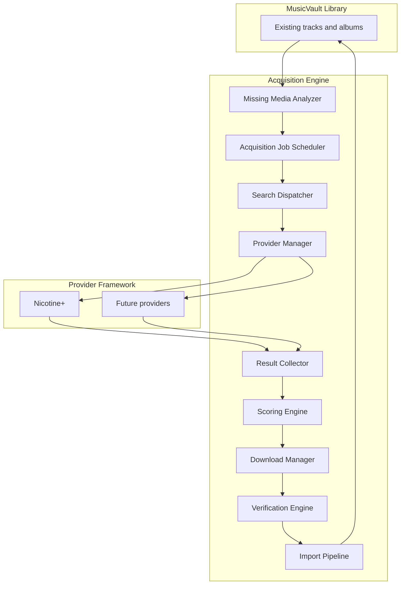
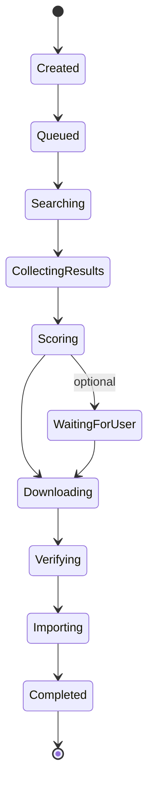

# VaultSeek

**Find what you're missing** — an intelligent music acquisition platform and companion to [MusicVault](https://github.com/oceanmasterza/MusicVault).

[](https://github.com/oceanmasterza/VaultSeek/actions/workflows/ci.yml)
[](https://www.python.org/downloads/)
[](LICENSE)
[]()

> **MusicVault** — Organise what you have.  
> **VaultSeek** — Find what you're missing.

VaultSeek is **not** a Soulseek client or a simple downloader. It is an **Acquisition Engine**: it analyses your existing library, identifies missing or improvable releases, searches external sources through pluggable **Providers**, scores results, sorts, **verifies** every file, imports through the same pipeline as MusicVault, and refreshes your media servers.

---

## Project overview

| | |
|---|---|
| **What** | Windows desktop app that completes and improves music libraries through provider-driven acquisition |
| **Why** | MusicVault organises what you already own; VaultSeek finds what is missing or worth upgrading |
| **How** | `AcquisitionJob` objects flow through the Acquisition Engine — from gap detection to verified import |

VaultSeek reuses MusicVault’s library pipeline (fingerprint, identify, organise, artwork, media-server sync) and adds acquisition on top. Data lives in a separate app directory: `%APPDATA%\VaultSeek`.

---

## Features

### Implemented

Inherited from the MusicVault fork (working today):

- Watch folder / scan Incoming, hash, fingerprint, identify
- Multi-provider metadata (MusicBrainz, AcoustID, local tags, filename parser)
- Review queue, rules engine, organize into Library
- Artwork (embedded, Cover Art Archive)
- Browse UI (Library, Artists, Albums, Artwork)
- Media server rescan (Navidrome, Jellyfin, Plex, Emby, Subsonic, Ampache, Koel, Funkwhale, Lyrion)
- Duplicate detection, rollback, operation history

VaultSeek-specific foundation:

- **AcquisitionJob** entity and state machine (persisted to SQLite)
- **AcquisitionEngine** — create, queue, cancel, advance with DB persistence
- **Missing Media Analyzer** — MusicBrainz tracklist gap detection + job creation
- **Provider Framework** — config-driven providers, `ProviderManager`, stub + Nicotine+
- **SearchDispatcher / ScoringEngine / DownloadManager** — acquisition pipeline
- **AcquisitionRunner** — search, score, auto-acquire above threshold, poll downloads
- **AcquisitionAutomationService** — background auto-acquire, download polling, retry backoff
- **Acquisition UI** — wishlist page with missing-media scan, result picker, retries/history column
- **LocalSocketRpcClient** — NDJSON socket protocol for Nicotine+ (port 22024)
- **HttpApiRpcClient** — api-nicotine-plus HTTP adapter (port 12339)
- **NDJSON proxy** — `scripts/nicotine_plus_ndjson_proxy.py` (socket → HTTP bridge)
- **VerificationEngine** — path, tags, content-hash / fingerprint duplicate checks
- **ImportPipeline** — stage into Incoming and enqueue scan (organize/artwork/media-server chain)
- Planning docs, ADRs, architectural update (`ARCHITECTURAL_UPDATE_001`)

### In development

- Quality-upgrade AcquisitionJobs
- Dashboard acquisition job summary
- Reports viewer UI (currently stub page)
- Plugin manager UI (currently stub page)

### Planned

- Additional providers (local archive, SMB, Lidarr, native Soulseek, …)
- Discogs metadata/artwork provider (schema columns exist; provider deferred)
- Shared `MusicVault.Core` library extraction
- Persist verification digests on `AcquisitionJob.extra`
- Nicotine+ in-process plugin (vs external proxy script)

---

## Architecture



**Acquisition Job lifecycle** (single source of truth for workflow status):



See [docs/ARCHITECTURE.md](docs/ARCHITECTURE.md) and [docs/ARCHITECTURAL_UPDATE_001.md](docs/ARCHITECTURAL_UPDATE_001.md) for full detail.

---

## Technology stack

| Layer | Technology |
|-------|------------|
| Language | Python 3.12+ |
| Desktop UI | PySide6 (Qt) |
| Database | SQLite via SQLAlchemy 2 + Alembic |
| DI | `Container` (explicit wiring) |
| Plugins | `typing.Protocol` (metadata, artwork, acquisition, media servers) |
| Logging | loguru |
| Testing | pytest, pytest-qt, responses |
| Lint / types | ruff, black, mypy, import-linter |
| Packaging | PyInstaller (Windows installer) |

Metadata: MusicBrainz, AcoustID. Artwork: Cover Art Archive, embedded tags. Discogs provider planned.

Full reference: [docs/TECH_STACK.md](docs/TECH_STACK.md).

---

## Development status

| | |
|---|---|
| **Maturity** | Early active development (post-fork, acquisition pipeline wired) |
| **Phase** | Phases 4–6 largely complete; Nicotine+ live + automation |
| **Tests** | 608 unit/integration tests passing |
| **Roadmap** | [docs/ROADMAP.md](docs/ROADMAP.md) (public) · [docs/DEVELOPMENT_ROADMAP.md](docs/DEVELOPMENT_ROADMAP.md) (internal / AI) · [Project board](https://github.com/users/oceanmasterza/projects/1) |

```powershell
git clone https://github.com/oceanmasterza/VaultSeek.git
cd VaultSeek
python -m pip install -e ".[dev]"
python -m pytest -q
```

Contributing: [CONTRIBUTING.md](CONTRIBUTING.md)

---

## Documentation

| Document | Purpose |
|----------|---------|
| [docs/PROJECT_PLAN.md](docs/PROJECT_PLAN.md) | Product vision and workflow |
| [docs/ARCHITECTURE.md](docs/ARCHITECTURE.md) | Layers, pipelines, diagrams |
| [docs/ARCHITECTURAL_UPDATE_001.md](docs/ARCHITECTURAL_UPDATE_001.md) | Acquisition Engine model (authoritative) |
| [docs/DECISIONS.md](docs/DECISIONS.md) | Architecture Decision Records |
| [docs/ROADMAP.md](docs/ROADMAP.md) | Public roadmap |
| [docs/DEVELOPMENT_ROADMAP.md](docs/DEVELOPMENT_ROADMAP.md) | Internal engineering notebook |
| [docs/AI_RULES.md](docs/AI_RULES.md) | AI pair-programming rules |
| [docs/TECH_STACK.md](docs/TECH_STACK.md) | Stack and tooling reference |
| [docs/NICOTINE_PLUS.md](docs/NICOTINE_PLUS.md) | Nicotine+ provider setup (HTTP vs socket) |
| [docs/architecture/](docs/architecture/) | Detailed MusicVault-era design docs (being aligned) |

---

## License

MIT — see [LICENSE](LICENSE).
