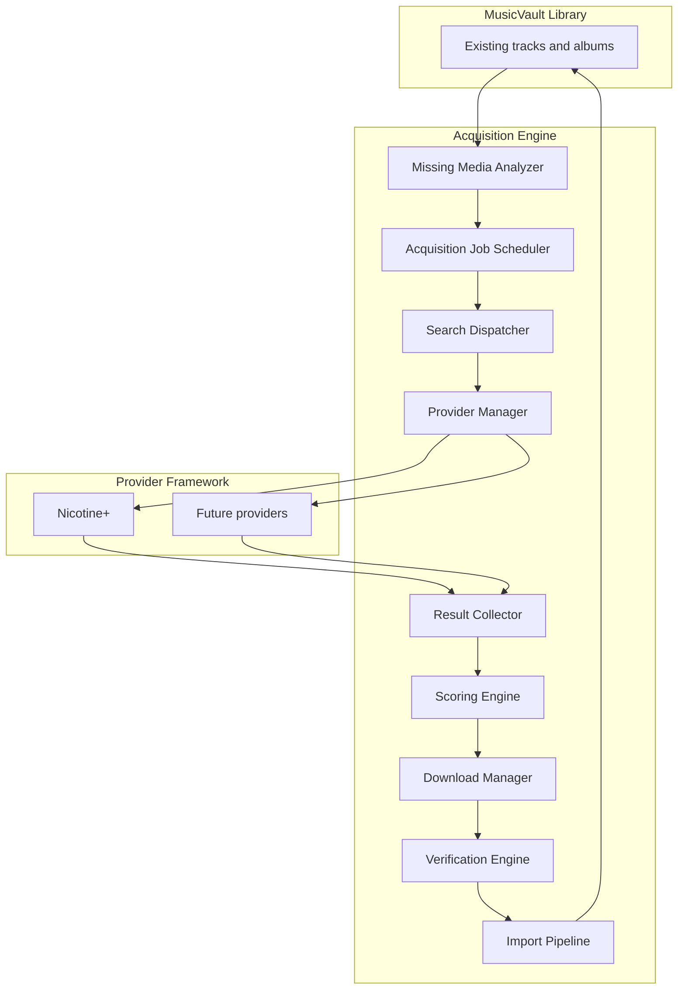
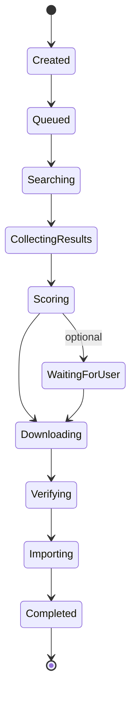

# VaultSeek

**Find what you're missing** — an intelligent music acquisition platform and companion to [MusicVault](https://github.com/oceanmasterza/MusicVault).

[](https://github.com/oceanmasterza/VaultSeek/actions/workflows/ci.yml)
[](https://www.python.org/downloads/)
[](LICENSE)
[]()

> **MusicVault** — Organise what you have.  
> **VaultSeek** — Find what you're missing.

VaultSeek is **not** a Soulseek client or a simple downloader. It is an **Acquisition Engine**: it analyses your existing library, identifies missing or improvable releases, searches external sources through pluggable **Providers**, scores results, downloads, **verifies** every file, imports through the same pipeline as MusicVault, and refreshes your media servers.

---

## Project overview

| | |
|---|---|
| **What** | Windows desktop app that completes and improves music libraries through provider-driven acquisition |
| **Why** | MusicVault organises what you already own; VaultSeek finds what is missing or worth upgrading |
| **How** | `AcquisitionJob` objects flow through the Acquisition Engine — from gap detection to verified import |

VaultSeek reuses MusicVault’s library pipeline (fingerprint, identify, organise, artwork, media-server sync) and adds acquisition on top. Data lives in a separate app directory: `%APPDATA%\VaultSeek`.

---

## Features

### Implemented

Inherited from the MusicVault fork (working today):

- Watch folder / scan Incoming, hash, fingerprint, identify
- Multi-provider metadata (MusicBrainz, AcoustID, Discogs, local tags, filename parser)
- Review queue, rules engine, organize into Library
- Artwork (embedded, Cover Art Archive, Discogs)
- Browse UI (Library, Artists, Albums, Artwork)
- Media server rescan (Navidrome, Jellyfin, Plex, Emby, Subsonic, Ampache, Koel, Funkwhale, Lyrion)
- Duplicate detection, rollback, operation history

VaultSeek-specific foundation:

- **AcquisitionJob** entity and state machine
- **AcquisitionEngine** skeleton (create, queue, cancel, advance)
- **Provider Framework** — `AcquisitionProvider` protocol, `ProviderManager`, stub provider
- Planning docs, ADRs, architectural update (`ARCHITECTURAL_UPDATE_001`)

### In development

- Persist AcquisitionJobs to the database
- Missing Media Analyzer (album / track gaps vs official releases)
- Nicotine+ Provider (first real acquisition source)
- Public acquisition UI (wishlist, job progress, recommendations)

### Planned

- Result scoring engine with configurable weights and auto-select above confidence threshold
- Download Manager (queue, retries, history)
- Verification Pipeline (fingerprint + metadata + duplicate checks before import)
- Quality-upgrade AcquisitionJobs
- Additional providers (local archive, SMB, Lidarr, native Soulseek, …)
- Shared `MusicVault.Core` library extraction

---

## Architecture



**Acquisition Job lifecycle** (single source of truth for workflow status):



See [docs/ARCHITECTURE.md](docs/ARCHITECTURE.md) and [docs/ARCHITECTURAL_UPDATE_001.md](docs/ARCHITECTURAL_UPDATE_001.md) for full detail.

---

## Technology stack

| Layer | Technology |
|-------|------------|
| Language | Python 3.14+ |
| Desktop UI | PySide6 (Qt) |
| Database | SQLite via SQLAlchemy 2 + Alembic |
| DI | `Container` (explicit wiring) |
| Plugins | `typing.Protocol` (metadata, artwork, acquisition, media servers) |
| Logging | loguru |
| Testing | pytest, pytest-qt, responses |
| Lint / types | ruff, black, mypy, import-linter |
| Packaging | PyInstaller (Windows installer) |

Metadata: MusicBrainz, AcoustID, Discogs. Artwork: Cover Art Archive, embedded tags, Discogs.

Full reference: [docs/TECH_STACK.md](docs/TECH_STACK.md).

---

## Development status

| | |
|---|---|
| **Maturity** | Early active development (post-fork, acquisition foundation) |
| **Phase** | Phase 2 — Acquisition Engine foundation |
| **Tests** | 550+ unit/integration tests passing |
| **Roadmap** | [docs/ROADMAP.md](docs/ROADMAP.md) (public) · [docs/DEVELOPMENT_ROADMAP.md](docs/DEVELOPMENT_ROADMAP.md) (internal / AI) |

```powershell
git clone https://github.com/oceanmasterza/VaultSeek.git
cd VaultSeek
python -m pip install -e ".[dev]"
python -m pytest -q
```

Contributing: [CONTRIBUTING.md](CONTRIBUTING.md)

---

## Documentation

| Document | Purpose |
|----------|---------|
| [docs/PROJECT_PLAN.md](docs/PROJECT_PLAN.md) | Product vision and workflow |
| [docs/ARCHITECTURE.md](docs/ARCHITECTURE.md) | Layers, pipelines, diagrams |
| [docs/ARCHITECTURAL_UPDATE_001.md](docs/ARCHITECTURAL_UPDATE_001.md) | Acquisition Engine model (authoritative) |
| [docs/DECISIONS.md](docs/DECISIONS.md) | Architecture Decision Records |
| [docs/ROADMAP.md](docs/ROADMAP.md) | Public roadmap |
| [docs/DEVELOPMENT_ROADMAP.md](docs/DEVELOPMENT_ROADMAP.md) | Internal engineering notebook |
| [docs/AI_RULES.md](docs/AI_RULES.md) | AI pair-programming rules |
| [docs/TECH_STACK.md](docs/TECH_STACK.md) | Stack and tooling reference |
| [docs/architecture/](docs/architecture/) | Detailed MusicVault-era design docs (being aligned) |

---

## License

MIT — see [LICENSE](LICENSE).
