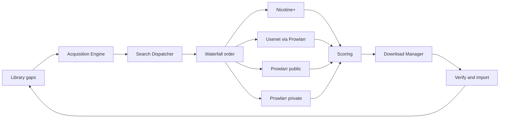

# VaultSeek

**Find what you're missing** — a Windows desktop app that completes and improves your music library through searchable download sources, verification, and the same organize / artwork / media-server pipeline you already use day to day.

[](https://github.com/oceanmasterza/VaultSeek/actions/workflows/ci.yml)
[](https://www.python.org/downloads/)
[](LICENSE)
[]()
[](CHANGELOG.md)

VaultSeek is an **Acquisition Engine**: it analyses your library, finds missing or improvable releases, searches external sources through pluggable **providers**, scores hits, downloads, **verifies** every file, imports into Incoming, and refreshes media servers.

Data lives under `%APPDATA%\VaultSeek`.

**Updated 22 September 2026** — version **1.1.0**, verified with **947** tests and Windows GUI startup / layout checks. Download clients and music services work when you install and configure them on your PC.

---

## Features

### Library & processing

- Watch Incoming, scan, hash, fingerprint, identify
- Metadata: MusicBrainz, AcoustID, Shazamio fallback, Discogs, local tags, filename parser
- **Identify** corroborates filename cues with your library tracklists (matching release identity, duration, and track evidence) and keeps Live / Acoustic / Remix (and other version text) as distinct album slots
- **Review** — Play a local file, **Assign album…** for manual allocation, approve / reject
- Organize into Library; **Albums** is the cover surface (embedded + Cover Art Archive), including **Problems only** for missing / low-res covers — there is no separate Artwork sidebar page; covers stay with the album they belong to
- **Archive selected…** moves music to Archive (reversible). **Delete album…** confirms, then recycles tracked files and removes library records (shared albums stay in other libraries)
- Browse UI: Library, Artists, Albums, Duplicates
- Media servers: Navidrome, Jellyfin, Plex, Emby, Subsonic, Ampache, Koel, Funkwhale, Lyrion
- Dashboard (responsive pipeline / toolbars; independent connection probes — **Connected** vs **Configured**), Jobs, Activity, Reports, Setup wizard

### Acquisition

- **Wishlist** — park albums, auto-search / download when ready
- **Nicotine+** — Soulseek search & download (HTTP api-nicotine-plus or NDJSON socket) under **Settings**
- **Usenet** — one Prowlarr NZB tier → **SABnzbd** (default) or optional **NZBGet** (not a second search source)
- **Prowlarr torrents** — public then private indexers → **qBittorrent**
- **Search waterfall** — try sources in order; stop when a tier finds hits (reorderable in Settings → Wishlist & downloads)
- Missing-media scans and **quality-upgrade** requests (Prefer lossless can still enqueue FLAC upgrades after a song is organized into your library even when a lossy file already meets min bitrate)
- Scoring, verification, import pipeline

### Discovery (opt-in Plugins page)

- **Similar music (Last.fm)** — albums by artists similar to your library
- **Spotify playlist sync** — mirror public playlists into the Wishlist

Everything on the Plugins page is **off by default** so the core stays lean.

**Settings vs Plugins:** Settings owns library folders, quality, wishlist / waterfall, Nicotine+, application, and media servers. Plugins owns Last.fm, Spotify, Prowlarr, qBittorrent, SABnzbd, NZBGet, and the Usenet client choice. Use each page’s own Save button.

---

## Architecture (short)


```mermaid
flowchart LR
  Library[Library gaps] --> Engine[Acquisition Engine]
  Engine --> Search[Search Dispatcher]
  Search --> Waterfall[Waterfall order]
  Waterfall --> Nic[Nicotine+]
  Waterfall --> Usenet[Usenet via Prowlarr]
  Waterfall --> Pub[Prowlarr public]
  Waterfall --> Priv[Prowlarr private]
  Nic --> Score[Scoring]
  Usenet --> Score
  Pub --> Score
  Priv --> Score
  Score --> DL[Download Manager]
  DL --> Verify[Verify and import]
  Verify --> Library
```

Details: [docs/ARCHITECTURE.md](docs/ARCHITECTURE.md), [docs/USER_GUIDE.md](docs/USER_GUIDE.md).

---

## Quick start (from source)

```powershell
git clone https://github.com/oceanmasterza/VaultSeek.git
cd VaultSeek
python -m venv .venv
.\.venv\Scripts\activate
python -m pip install -e ".[dev]"
python -m vaultseek
```

**First run:** create a library (Incoming / Staging / Library / Archive), then enable providers under **System → Plugins** and **Settings**. For setup help, press **F1** and open the **Connection setup** section ([docs/HELP.html](docs/HELP.html)).

---

## Windows installer

Build on **Windows** with the project **venv** and **Inno Setup 6** installed. Full steps: [packaging/README.md](packaging/README.md).

```powershell
.\.venv\Scripts\activate
pip install -e ".[dev,build]"
.\packaging\build_windows.ps1
```

With Inno Setup available, that produces the portable app at `dist/VaultSeek/` and the installer at `packaging/output/VaultSeek-Setup.exe`.

---

## Documentation

| Document | Purpose |
|----------|---------|
| [AGENTS.md](AGENTS.md) | **AI assistants** — repo map, waterfall, settings ownership, GitLab `main` |
| [docs/USER_GUIDE.md](docs/USER_GUIDE.md) / in-app **F1** | Setup, where to change settings, download options |
| [docs/HELP.html](docs/HELP.html) | In-app help (Connection setup / API links) |
| [docs/SOURCES.md](docs/SOURCES.md) | What searches music today, and other quality sources |
| [docs/PROWLARR.md](docs/PROWLARR.md) | Prowlarr tiers + qBittorrent + SABnzbd / NZBGet |
| [docs/NICOTINE_PLUS.md](docs/NICOTINE_PLUS.md) | Nicotine+ HTTP / socket |
| [docs/ARCHITECTURE.md](docs/ARCHITECTURE.md) | Layers and pipelines |
| [packaging/README.md](packaging/README.md) | PyInstaller onedir + Inno installer |
| [docs/AI_RULES.md](docs/AI_RULES.md) | Coding / docs rules for humans and AI |
| [CHANGELOG.md](CHANGELOG.md) | Released versions |
| [CONTRIBUTING.md](CONTRIBUTING.md) | Dev setup (venv) |

External API / client docs (also linked from in-app Help): [AcoustID](https://acoustid.org/webservice), [Discogs developers](https://www.discogs.com/settings/developers), [Prowlarr settings](https://wiki.servarr.com/prowlarr/settings), [SABnzbd General](https://sabnzbd.org/wiki/configuration/5.1/general), [NZBGet API](https://nzbget.com/documentation/api/), [api-nicotine-plus](https://github.com/palaueb/api-nicotine-plus), [Last.fm API](https://www.last.fm/api/account/create), [Spotify Web API](https://developer.spotify.com/dashboard).

---

## Development

| | |
|---|---|
| **Version** | 1.1.0 |
| **Stack** | Python 3.12+, PySide6, SQLite / SQLAlchemy 2, Alembic |
| **Tests** | `python -m pytest -q` |
| **Lint** | ruff, black, mypy (strict), import-linter |

```powershell
.\.venv\Scripts\activate
python -m pip install -e ".[dev]"
python -m pytest -q
```

---

## License

MIT — see [LICENSE](LICENSE).
