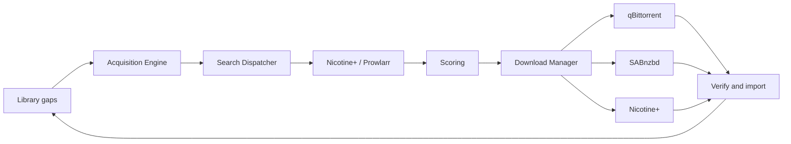

# VaultSeek

**Find what you're missing** — a Windows desktop app that completes and improves your music library through searchable download sources, verification, and the same organize / artwork / media-server pipeline you already use day to day.

[](https://github.com/oceanmasterza/VaultSeek/actions/workflows/ci.yml)
[](https://www.python.org/downloads/)
[](LICENSE)
[]()
[](CHANGELOG.md)

VaultSeek is an **Acquisition Engine**: it analyses your library, finds missing or improvable releases, searches external sources through pluggable **providers**, scores hits, downloads, **verifies** every file, imports into Incoming, and refreshes media servers.

Data lives under `%APPDATA%\VaultSeek`.

---

## Features

### Library & processing

- Watch Incoming, scan, hash, fingerprint, identify
- Metadata: MusicBrainz, AcoustID, Shazamio fallback, Discogs, local tags, filename parser
- Review queue, rules, organize into Library, artwork (embedded + Cover Art Archive)
- Browse UI: Library, Artists, Albums, Artwork, Duplicates
- Media servers: Navidrome, Jellyfin, Plex, Emby, Subsonic, Ampache, Koel, Funkwhale, Lyrion
- Dashboard, Jobs, Activity, Reports, Setup wizard

### Acquisition

- **Wishlist** — park albums, auto-search / download when ready
- **Nicotine+** — Soulseek search & download (HTTP api-nicotine-plus or NDJSON socket)
- **Prowlarr** — indexer search with downloads via **qBittorrent** (torrents) and/or **SABnzbd** (Usenet / NZB)
- Missing-media & quality-upgrade scans
- Scoring, verification, import pipeline

### Discovery (opt-in Plugins page)

- **Similar music (Last.fm)** — albums by artists similar to your library
- **Spotify playlist sync** — mirror public playlists into the Wishlist

Everything on the Plugins page is **off by default** so the core stays lean.

---

## Architecture (short)


```mermaid
flowchart LR
  Library[Library gaps] --> Engine[Acquisition Engine]
  Engine --> Search[Search Dispatcher]
  Search --> Providers[Nicotine+ / Prowlarr]
  Providers --> Score[Scoring]
  Score --> DL[Download Manager]
  DL --> QBit[qBittorrent]
  DL --> SAB[SABnzbd]
  DL --> Nic[Nicotine+]
  QBit --> Verify[Verify and import]
  SAB --> Verify
  Nic --> Verify
  Verify --> Library
```

Details: [docs/ARCHITECTURE.md](docs/ARCHITECTURE.md), [docs/USER_GUIDE.md](docs/USER_GUIDE.md).

---

## Quick start

```powershell
git clone https://github.com/oceanmasterza/VaultSeek.git
cd VaultSeek
python -m pip install -e ".[dev]"
python -m vaultseek
```

Or download a Windows build from [Releases](https://github.com/oceanmasterza/VaultSeek/releases).

**First run:** create a library (Incoming / Staging / Library / Archive), then enable providers under **System → Plugins** and **Settings**.

---

## Documentation

| Document | Purpose |
|----------|---------|
| [docs/USER_GUIDE.md](docs/USER_GUIDE.md) | Setup, credentials, troubleshooting |
| [docs/PROWLARR.md](docs/PROWLARR.md) | Prowlarr + qBittorrent + SABnzbd |
| [docs/NICOTINE_PLUS.md](docs/NICOTINE_PLUS.md) | Nicotine+ HTTP / socket |
| [docs/ARCHITECTURE.md](docs/ARCHITECTURE.md) | Layers and pipelines |
| [CHANGELOG.md](CHANGELOG.md) | Released versions |
| [CONTRIBUTING.md](CONTRIBUTING.md) | Dev setup |

---

## Development

| | |
|---|---|
| **Version** | 1.1.0 |
| **Stack** | Python 3.12+, PySide6, SQLite / SQLAlchemy 2, Alembic |
| **Tests** | `python -m pytest -q` |
| **Lint** | ruff, black, mypy (strict), import-linter |

```powershell
python -m pip install -e ".[dev]"
python -m pytest -q
```

---

## License

MIT — see [LICENSE](LICENSE).
