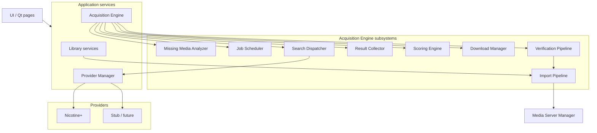
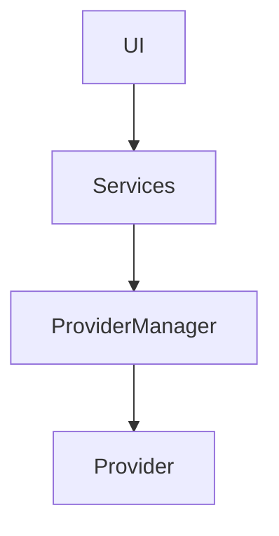
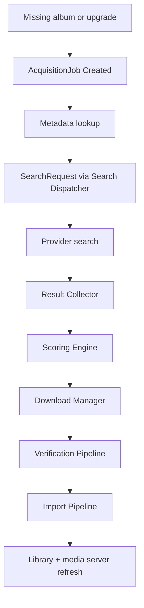
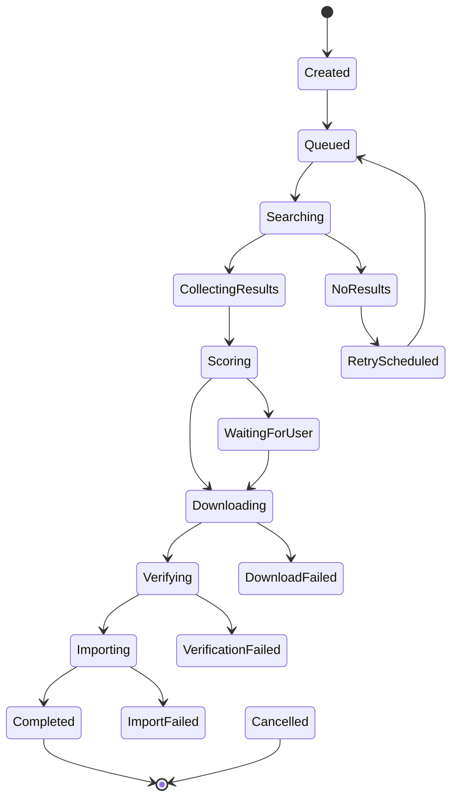

# ARCHITECTURE.md

# VaultSeek Architecture

> **Terminology:** The central workflow is the **Acquisition Engine**, not a “Search Engine”.
> See [ARCHITECTURAL_UPDATE_001.md](ARCHITECTURAL_UPDATE_001.md) and ADR-0017 in [DECISIONS.md](DECISIONS.md).

## Overview

VaultSeek is a modular, provider-driven Windows desktop application.

It extends MusicVault by adding intelligent music **acquisition** while preserving the existing library management **Import Pipeline** (fingerprint, identify, organize, artwork, media-server sync).

New providers and metadata sources plug in without modifying core Acquisition Engine logic.

**Runtime:** Python 3.14, PySide6, SQLite, Container-based DI, `typing.Protocol` for plugins (ADR-0016).

---

# High-Level Architecture



---

# Layer Responsibilities

## UI

Presentation only. No business logic. Talks to thin page controllers / services — never to Providers directly.

## Services

Business logic lives in `vaultseek/services/` and workers.

Examples:

- Library / metadata services (MusicVault heritage)
- **AcquisitionEngine** — coordinates `AcquisitionJob` lifecycle
- **ProviderManager** — sole gateway to acquisition Providers
- Import / verification services (planned)

## Providers

External communication only (`plugins/builtin/…`).

Examples: Nicotine+ (planned), stub provider (today), future local archive / Lidarr / …

Providers return normalized `SearchResult` and file paths. They never modify the library or run the Import Pipeline.

---

# Dependency Rules



**Not allowed:** UI → Provider, Provider → UI, Provider → database, Provider → Import Pipeline.

---

# Plugin Architecture (Python)

```
src/vaultseek/plugins/builtin/
    acquisition_stub/     # Phase 1 placeholder
    nicotine/             # planned
    musicbrainz/          # metadata (heritage)
    cover_art_archive/    # artwork (heritage)
    navidrome/            # media server (heritage)
```

Every **AcquisitionProvider** implements: `connect`, `disconnect`, `search`, `download`, `cancel`, `get_status`, `capabilities`.

---

# Acquisition Pipeline

Each step updates an **AcquisitionJob** — subsystems do not call each other directly.



Every step is independently testable.

---

# Acquisition Job lifecycle



Implementation: `vaultseek/models/entities/acquisition_job.py`.

---

# Result Scoring Pipeline

Provider-neutral. All Providers emit normalized results; Scoring Engine picks the best match.

```
Search Results → Normalize → Artist → Album → Track count → Codec →
Bit depth → Year → Folder structure → Trusted source → Final score
```

Weights are configurable (planned).

---

# Verification Pipeline

Mandatory before Import (ADR-0005). No downloaded file enters the library without:

- Readable format
- Fingerprint validation
- Metadata comparison
- Duplicate detection
- Release verification

---

# Import Pipeline

Reuses MusicVault workers/services:

```
Downloaded files → Read metadata → Fingerprint → MB validation →
Duplicates → Artwork → Organise → Library → Media server refresh
```

---

# Configuration

Strongly typed dataclasses in `vaultseek.core.config` — not ad-hoc dicts for app settings.

Acquisition-specific settings (planned): provider tokens, scoring weights, auto-acquire threshold, concurrent downloads.

---

# Logging

Structured logging via **loguru**. Never `print()` for operational messages in production paths.

---

# Concurrency

Long-running work runs in worker threads/processes; UI stays responsive. Cooperative cancellation on jobs (AcquisitionJob cancel, download cancel).

---

# Testing Strategy

- Unit tests per service and state machine
- Mock Providers for Acquisition Engine tests
- Integration tests for provider IPC (when Nicotine+ lands)
- No live external API calls in CI — use `responses` fixtures

See [architecture/09-testing-strategy.md](architecture/09-testing-strategy.md).

---

# Shared Code Strategy

Long-term: extract **MusicVault.Core** (fingerprint, metadata, artwork, library, import, media servers) consumed by both MusicVault and VaultSeek (ADR-0015).

---

# Design Principles

Single Responsibility · Open/Closed · Dependency Inversion · Composition over inheritance · Small, readable modules · **Documentation follows architecture changes**

Further reading: [PROJECT_PLAN.md](PROJECT_PLAN.md), [TECH_STACK.md](TECH_STACK.md), [ROADMAP.md](ROADMAP.md).
