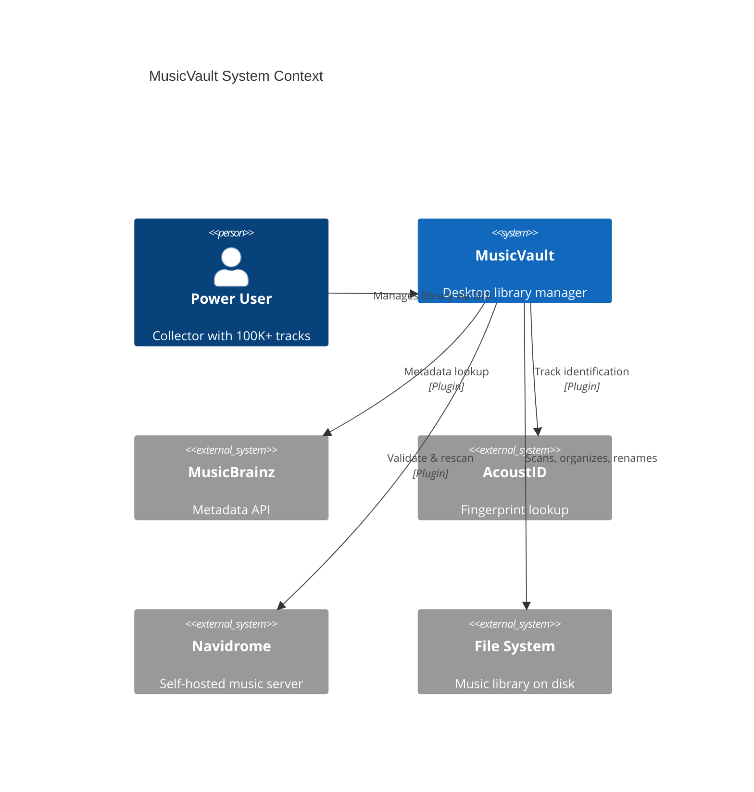

# 01 — System Overview

## Purpose

MusicVault is a desktop Windows application that automates music library management for collectors and self-hosted media server users. It operates as a **local-first** tool: all data lives on the user's machine in SQLite, with optional integration to remote services (MusicBrainz, Navidrome) via plugins.

## System Context



## Layered Architecture

MusicVault follows a strict **four-layer architecture** with an orthogonal **plugin layer**.

### Layer 1: Presentation (GUI)

- **Responsibility**: Display data, capture user input, show progress
- **Technology**: PySide6, MVVM pattern
- **Rules**:
  - Views contain zero business logic
  - ViewModels call Application Services only (never repositories)
  - Long-running operations run in `QThreadPool` workers; results delivered via signals
  - All UI strings externalized for future i18n

### Layer 2: Application

- **Responsibility**: Orchestrate use cases, coordinate services, enforce workflows
- **Key components**: `ScannerService`, `MetadataService`, `DuplicateService`, `OrganizerService`, `RollbackService`, `ReportService`, `OperationOrchestrator`
- **Rules**:
  - Services are stateless; state lives in the database
  - Every mutating operation goes through `OperationOrchestrator` for rollback support
  - Services depend on interfaces (protocols), not concrete implementations

### Layer 3: Domain

- **Responsibility**: Core business rules, entities, value objects
- **Key components**: `Track`, `Album`, `Artist`, `Fingerprint`, `QualityScore`, `DuplicateGroup`, `OrganizeRule`, `RenamePattern`
- **Rules**:
  - No imports from GUI, SQLAlchemy, or Qt
  - Pure Python with dataclasses and protocols
  - Domain services contain logic that spans multiple entities (e.g., `QualityScorer`, `DuplicateMatcher`)

### Layer 4: Infrastructure

- **Responsibility**: External system integration — database, filesystem, FFmpeg, HTTP
- **Key components**: SQLAlchemy repositories, `AudioFileReader` (Mutagen), `FingerprintGenerator` (Chromaprint), `FileOperations` (Send2Trash)
- **Rules**:
  - Implements interfaces defined in Domain/Application layers
  - All I/O is behind interfaces for testability

### Orthogonal: Plugin Layer

- **Responsibility**: Extend metadata, artwork, and media server integration
- **Rules**:
  - Plugins implement well-defined protocols
  - Core application never imports plugin implementations directly
  - Plugin manager discovers and registers plugins at startup

## Core Data Flows

### Scan Flow

```
User clicks "Scan"
  → ScanViewModel.start_scan()
    → ScannerService.scan_library(paths, options)
      → FileWalker.discover_files()          [Infrastructure]
      → ThreadPool: for each file:
          → AudioFileReader.read_metadata()   [Infrastructure / Mutagen]
          → FingerprintGenerator.generate()   [Infrastructure / Chromaprint]
          → HashCalculator.compute()          [Infrastructure]
          → TrackRepository.upsert()          [Infrastructure / SQLAlchemy]
      → ScanRepository.record_scan()          [Infrastructure]
    → Signal: scan_progress(percent, stats)
    → Signal: scan_complete(scan_id)
```

### Metadata Fix Flow

```
User selects tracks → "Fix Metadata"
  → MetadataViewModel.fix_metadata(track_ids)
    → OperationOrchestrator.begin_operation("metadata_fix")
      → RollbackService.snapshot(tracks)     [store originals]
      → MetadataService.identify(tracks)
        → PluginManager.get("musicbrainz").lookup(fingerprint)
        → MetadataService.apply_matches(tracks, matches)
      → OperationOrchestrator.commit()       [or rollback on cancel]
    → Signal: operation_complete(report)
```

### Duplicate Detection Flow

```
DuplicateService.detect_duplicates(library_id)
  → Load all fingerprints from DB
  → Group by AcoustID / MusicBrainz recording ID
  → For unmatched: fuzzy match on (duration, fingerprint similarity)
  → QualityScorer.score(each track in group)
  → DuplicateRepository.save_groups()
  → Return DuplicateReport
```

## Dependency Injection

All services are constructed via a central `Container` (using `dependency-injector` or a lightweight manual registry):

```python
# Conceptual — not implemented yet
class Container:
    # Infrastructure
    session_factory: Callable[[], Session]
    track_repository: TrackRepository
    audio_file_reader: AudioFileReader

    # Domain
    quality_scorer: QualityScorer
    duplicate_matcher: DuplicateMatcher

    # Application
    scanner_service: ScannerService
    metadata_service: MetadataService
    duplicate_service: DuplicateService

    # Plugins
    plugin_manager: PluginManager
```

Services receive dependencies through constructor injection. The GUI receives the `Container` (or a facade) and resolves ViewModels from it.

## Operation Safety Model

Every mutating operation follows this contract:

1. **Dry-run mode** — compute changes without applying (default for first run)
2. **Preview** — show user a diff of proposed changes
3. **Confirmation** — explicit user approval
4. **Snapshot** — `RollbackService` captures pre-state (file path, metadata, artwork bytes, DB row)
5. **Execute** — apply changes transactionally
6. **Log** — record in `change_history` and `operation_log`
7. **Rollback** — user can undo any operation via `RollbackService.restore(snapshot_id)`

File deletions always use `Send2Trash` (Recycle Bin).

## Configuration

- **Location**: `%APPDATA%/MusicVault/config.json`
- **Format**: Versioned JSON with schema migration
- **Sections**: `library_paths`, `organize_rules`, `rename_patterns`, `quality_weights`, `plugins`, `ui_preferences`, `scan_options`
- **Migration**: `ConfigMigrator` upgrades older versions automatically on load

## Logging

| Log | Path | Level | Purpose |
|-----|------|-------|---------|
| User log | `%APPDATA%/MusicVault/logs/musicvault.log` | INFO | Operations, scan results, user actions |
| Developer log | `%APPDATA%/MusicVault/logs/debug.log` | DEBUG | Full diagnostic detail |
| Crash report | `%APPDATA%/MusicVault/logs/crashes/` | ERROR | Uncaught exceptions with stack traces |

Loguru handles rotation (10 MB, 5 backups), structured logging, and sink configuration.

## Error Handling Strategy

| Category | Handling |
|----------|----------|
| Corrupt audio file | Log warning, skip file, include in scan report |
| Network timeout (MusicBrainz) | Retry with exponential backoff, rate-limit respect |
| Database locked | Retry with WAL mode, connection pooling |
| Permission denied (file) | Log error, skip file, notify user |
| Unhandled exception | Catch at service boundary, log crash report, show user-friendly dialog |

## Security Considerations

- No remote code execution from plugins (plugins are local Python packages)
- API keys stored in `%APPDATA%/MusicVault/secrets.json` (not in config)
- MusicBrainz user-agent identification required
- No telemetry; all data stays local unless user configures cloud backup plugin
