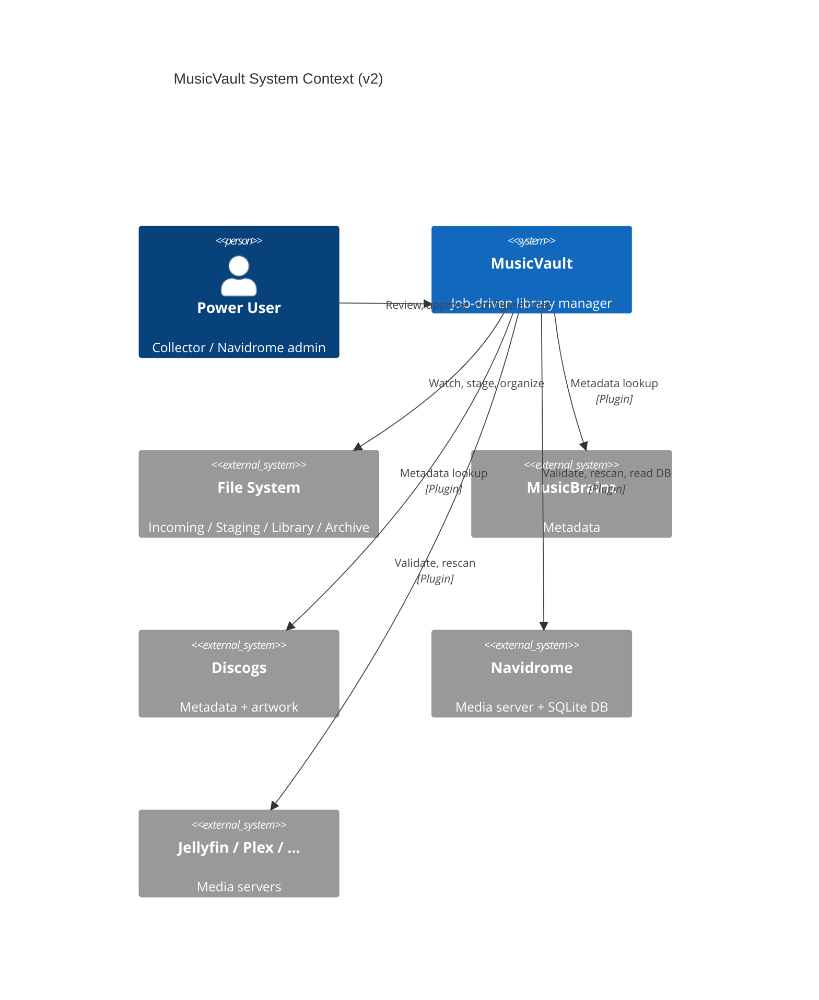

# 01 — System Overview (v2)

> **Revision**: v2 — See [10-revision-v2.md](10-revision-v2.md) for full rationale and scalability review.

## Purpose

MusicVault is a desktop Windows application that automates music library management for collectors and self-hosted media server users. It operates as a **local-first, job-driven** system: all data lives in SQLite, processing happens through a persistent job queue, and uncertain results go to a human review queue before touching the canonical library.

## Target Users

- Power users and collectors with 100,000–1,000,000+ tracks
- Audiophiles managing FLAC, DSD, and multi-format collections
- Self-hosted media server operators using:
  - **Navidrome**, **Jellyfin**, **Plex Media Server**, **Emby**
  - **Ampache**, **Koel**, **Subsonic**, **Funkwhale**
  - **Lyrion Music Server** (Logitech Media Server), **mStream**

## System Context



## Layered Architecture

### Layer 1: Presentation (GUI)

- PySide6 MVVM — Views, ViewModels, Workers
- New pages: **Review Queue**, **Job Monitor**, **Duplicate Viewer**, **Rules Editor**
- ViewModels read job status and review items from application services

### Layer 2: Application

| Component | Responsibility |
|-----------|---------------|
| `JobQueueService` | Enqueue, claim, complete, retry jobs |
| `JobDispatcher` | Poll queue, assign to worker pools |
| `MetadataArbitrator` | Multi-provider lookup with per-field confidence |
| `ReviewQueueService` | Create, approve, reject review items |
| `RulesEngine` | Evaluate user-defined IF/THEN rules |
| `OperationOrchestrator` | Safety gate with rollback snapshots |
| `WatchFolderService` | Monitor Incoming/, enqueue pipeline |

Legacy service names (`ScannerService`, etc.) become **worker implementations** invoked by the job dispatcher, not direct call chains.

### Layer 3: Domain

- Pure Python dataclasses with UUID identities
- `QualityScorer`, `DuplicateMatcher`, `RenameEngine`, `OrganizeEngine`
- `RuleCondition`, `RuleAction`, `FieldConfidence`, `ArbitrationResult`
- No SQLAlchemy, no Qt imports

### Layer 4: Infrastructure

- **SQLAlchemy Core** repositories (not ORM)
- Mutagen, Chromaprint, FFmpeg, Send2Trash
- File watcher (ReadDirectoryChangesW)

### Orthogonal: Plugin Layer

- Metadata providers ranked: MusicBrainz → Discogs → Local Tags → Filename
- Artwork providers: Cover Art Archive → Discogs
- Media server plugins with optional direct DB access

## Core Data Flow: Watch Folder Pipeline

The primary automation flow — zero clicks after initial setup:

```
File lands in Incoming/
  │
  ▼
FileWatcher → enqueue scan_file job
  │
  ▼
HashWorker → file_identity unchanged? → skip to metadata
           → changed? → enqueue fingerprint_file
  │
  ▼
FingerprintWorker → store in file_identity → enqueue identify_metadata
  │
  ▼
MetadataWorker → MetadataArbitrator
               → per-field confidence stored
               → any field < 90%? → create review_item
  │
  ▼
ArtworkWorker + DuplicateWorker + RuleEngine (parallel jobs)
  │
  ▼
OrganizerWorker → move to Staging/ (never directly to Library/)
  │
  ▼
All confidence ≥ 90% AND no review items?
  YES → auto-approve → move Staging → Library
  NO  → wait in Review Queue for user
  │
  ▼
MediaServerWorker → trigger Navidrome rescan
```

Every step is a row in `jobs`. Crash at any point → restart → pending jobs resume.

## Library Zones

| Zone | Purpose | User Access |
|------|---------|-------------|
| `incoming` | Watch folder; new downloads | Drop files here |
| `staging` | Processed, awaiting approval | Review before commit |
| `library` | Canonical approved collection | Normal browsing |
| `archive` | Superseded copies (MP3 when FLAC exists) | Recovery if needed |

## Metadata Arbitration

Not MusicBrainz-only. The `MetadataArbitrator`:

1. Queries all enabled providers in priority order
2. Collects results with per-field confidence
3. Selects highest-confidence value **per field**
4. Flags fields below 90% threshold for review
5. Stores provenance (`source: musicbrainz, confidence: 0.98`)

## Safety Model

1. **Watch folder** → always lands in Staging first
2. **Confidence gate** → uncertain metadata goes to Review Queue
3. **Rules engine** → configurable automation with optional approval
4. **Dry-run / preview** → for bulk operations
5. **Rollback snapshots** → before every approved change
6. **Send2Trash** → never hard-delete
7. **Zone isolation** → mistakes in Staging don't affect Library

## Dependency Injection

```python
class Container:
    # Infrastructure
    engine: Engine                          # SQLAlchemy Core
    track_repository: TrackRepository
    job_repository: JobRepository

    # Application
    job_queue_service: JobQueueService
    job_dispatcher: JobDispatcher
    metadata_arbitrator: MetadataArbitrator
    review_queue_service: ReviewQueueService
    rules_engine: RulesEngine
    watch_folder_service: WatchFolderService
    operation_orchestrator: OperationOrchestrator

    # Plugins
    plugin_manager: PluginManager
```

## Configuration

- Location: `%APPDATA%/MusicVault/config.json`
- Versioned JSON with migration chain
- Key sections: `library_zones`, `watch_folder`, `auto_approve_threshold`, `metadata_providers`, `rules`, `quality_weights`, `plugins`

## Logging

| Log | Level | Purpose |
|-----|-------|---------|
| `musicvault.log` | INFO | User-visible operations |
| `debug.log` | DEBUG | Job dispatch, SQL queries, API calls |
| `crashes/` | ERROR | Uncaught exceptions |

Job transitions logged: `Job {id} hash_file pending→running→completed (142ms)`.
