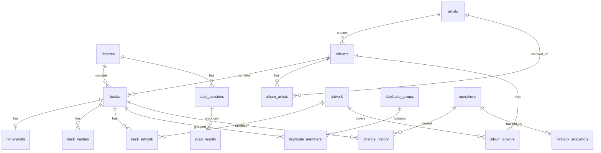

# 03 — Database Schema

## Design Principles

1. **SQLite with WAL mode** — concurrent reads during writes, proven at millions of rows
2. **Normalized core, denormalized views** — junction tables for M:N; materialized stats for dashboard
3. **Soft references** — file paths stored but validated on access (files can move)
4. **Audit everything** — `change_history` and `rollback_snapshots` for full reversibility
5. **Indexed for query patterns** — every GUI page has supporting indexes
6. **Alembic migrations** — schema evolves with versioned upgrade scripts

## Entity-Relationship Diagram



## Tables

### Core Library

#### `libraries`

Represents a music library (one or more root paths).

| Column | Type | Constraints | Description |
|--------|------|-------------|-------------|
| `id` | INTEGER | PK, AUTO | |
| `name` | TEXT | NOT NULL | Display name |
| `root_paths` | TEXT | NOT NULL | JSON array of root directories |
| `created_at` | TEXT | NOT NULL | ISO 8601 |
| `updated_at` | TEXT | NOT NULL | ISO 8601 |
| `track_count` | INTEGER | DEFAULT 0 | Denormalized count |
| `album_count` | INTEGER | DEFAULT 0 | Denormalized |
| `artist_count` | INTEGER | DEFAULT 0 | Denormalized |
| `total_size_bytes` | INTEGER | DEFAULT 0 | Denormalized |
| `last_scan_id` | INTEGER | FK → scan_sessions | Most recent scan |

#### `artists`

| Column | Type | Constraints | Description |
|--------|------|-------------|-------------|
| `id` | INTEGER | PK, AUTO | |
| `name` | TEXT | NOT NULL | Canonical artist name |
| `sort_name` | TEXT | NOT NULL | For alphabetical sorting |
| `mbid` | TEXT | UNIQUE, NULL | MusicBrainz artist ID |
| `type` | TEXT | NULL | Person, Group, Orchestra, etc. |
| `country` | TEXT | NULL | ISO 3166-1 alpha-2 |
| `created_at` | TEXT | NOT NULL | |
| `updated_at` | TEXT | NOT NULL | |

**Indexes**: `idx_artists_name`, `idx_artists_sort_name`, `idx_artists_mbid`

#### `albums`

| Column | Type | Constraints | Description |
|--------|------|-------------|-------------|
| `id` | INTEGER | PK, AUTO | |
| `title` | TEXT | NOT NULL | |
| `sort_title` | TEXT | NOT NULL | |
| `album_artist_id` | INTEGER | FK → artists, NULL | Album-level artist |
| `year` | INTEGER | NULL | Release year |
| `release_date` | TEXT | NULL | Full date if known |
| `mbid` | TEXT | UNIQUE, NULL | MusicBrainz release ID |
| `release_group_mbid` | TEXT | NULL | MB release group ID |
| `type` | TEXT | NULL | Album, Single, EP, Compilation |
| `genre` | TEXT | NULL | Primary genre |
| `label` | TEXT | NULL | Record label |
| `catalog_number` | TEXT | NULL | |
| `country` | TEXT | NULL | Release country |
| `disc_count` | INTEGER | DEFAULT 1 | |
| `track_count` | INTEGER | DEFAULT 0 | Denormalized |
| `is_compilation` | BOOLEAN | DEFAULT FALSE | |
| `is_soundtrack` | BOOLEAN | DEFAULT FALSE | |
| `is_classical` | BOOLEAN | DEFAULT FALSE | |
| `is_audiobook` | BOOLEAN | DEFAULT FALSE | |
| `created_at` | TEXT | NOT NULL | |
| `updated_at` | TEXT | NOT NULL | |

**Indexes**: `idx_albums_title`, `idx_albums_mbid`, `idx_albums_release_group_mbid`, `idx_albums_artist_year`

#### `album_artists`

Junction table for multi-artist albums.

| Column | Type | Constraints |
|--------|------|-------------|
| `album_id` | INTEGER | PK, FK → albums |
| `artist_id` | INTEGER | PK, FK → artists |
| `role` | TEXT | DEFAULT 'primary' |
| `position` | INTEGER | DEFAULT 0 |

#### `tracks`

Central table — one row per audio file.

| Column | Type | Constraints | Description |
|--------|------|-------------|-------------|
| `id` | INTEGER | PK, AUTO | |
| `library_id` | INTEGER | FK → libraries, NOT NULL | |
| `album_id` | INTEGER | FK → albums, NULL | NULL = unlinked |
| `artist_id` | INTEGER | FK → artists, NULL | Track artist |
| `file_path` | TEXT | NOT NULL | Absolute path |
| `file_name` | TEXT | NOT NULL | Base name |
| `file_size` | INTEGER | NOT NULL | Bytes |
| `file_modified` | TEXT | NOT NULL | ISO 8601 mtime |
| `title` | TEXT | NULL | From tags |
| `track_number` | INTEGER | NULL | |
| `disc_number` | INTEGER | DEFAULT 1 | |
| `duration_ms` | INTEGER | NULL | Milliseconds |
| `bitrate` | INTEGER | NULL | kbps |
| `bit_depth` | INTEGER | NULL | bits |
| `sample_rate` | INTEGER | NULL | Hz |
| `channels` | INTEGER | NULL | |
| `codec` | TEXT | NULL | flac, mp3, aac, etc. |
| `is_lossless` | BOOLEAN | DEFAULT FALSE | |
| `quality_score` | INTEGER | NULL | 0–100 |
| `replaygain_track` | REAL | NULL | dB |
| `replaygain_album` | REAL | NULL | dB |
| `mb_recording_id` | TEXT | NULL | MusicBrainz recording ID |
| `mb_track_id` | TEXT | NULL | MusicBrainz track ID |
| `composer` | TEXT | NULL | |
| `genre` | TEXT | NULL | |
| `year` | INTEGER | NULL | |
| `has_embedded_art` | BOOLEAN | DEFAULT FALSE | |
| `is_corrupt` | BOOLEAN | DEFAULT FALSE | |
| `is_unknown` | BOOLEAN | DEFAULT FALSE | Failed identification |
| `scan_session_id` | INTEGER | FK → scan_sessions | Last scan that touched this |
| `created_at` | TEXT | NOT NULL | |
| `updated_at` | TEXT | NOT NULL | |

**Indexes**:
- `idx_tracks_library` ON (`library_id`)
- `idx_tracks_album` ON (`album_id`)
- `idx_tracks_artist` ON (`artist_id`)
- `idx_tracks_file_path` UNIQUE ON (`file_path`)
- `idx_tracks_mb_recording` ON (`mb_recording_id`)
- `idx_tracks_quality` ON (`quality_score`)
- `idx_tracks_unknown` ON (`is_unknown`) WHERE `is_unknown` = TRUE
- `idx_tracks_codec` ON (`codec`)

### Fingerprints & Hashes

#### `fingerprints`

| Column | Type | Constraints | Description |
|--------|------|-------------|-------------|
| `id` | INTEGER | PK, AUTO | |
| `track_id` | INTEGER | FK → tracks, UNIQUE, NOT NULL | |
| `chromaprint` | BLOB | NOT NULL | Raw fingerprint bytes |
| `chromaprint_duration` | REAL | NOT NULL | Seconds |
| `acoustid_id` | TEXT | NULL | AcoustID lookup result |
| `acoustid_score` | REAL | NULL | Match confidence 0.0–1.0 |
| `generated_at` | TEXT | NOT NULL | |

**Indexes**: `idx_fingerprints_acoustid` ON (`acoustid_id`)

#### `track_hashes`

Multiple hash types per track for duplicate detection.

| Column | Type | Constraints | Description |
|--------|------|-------------|-------------|
| `id` | INTEGER | PK, AUTO | |
| `track_id` | INTEGER | FK → tracks, NOT NULL | |
| `hash_type` | TEXT | NOT NULL | `content_md5`, `content_sha256`, `audio_hash` |
| `hash_value` | TEXT | NOT NULL | Hex string |

**Indexes**: `idx_hashes_type_value` ON (`hash_type`, `hash_value`)

### Artwork

#### `artwork`

| Column | Type | Constraints | Description |
|--------|------|-------------|-------------|
| `id` | INTEGER | PK, AUTO | |
| `source` | TEXT | NOT NULL | `embedded`, `cover_art_archive`, `discogs`, `manual` |
| `source_id` | TEXT | NULL | External ID (CAA release ID, etc.) |
| `mime_type` | TEXT | NOT NULL | `image/jpeg`, `image/png` |
| `width` | INTEGER | NOT NULL | Pixels |
| `height` | INTEGER | NOT NULL | Pixels |
| `file_size` | INTEGER | NOT NULL | Bytes |
| `data` | BLOB | NULL | Stored locally (optional, for embedded cache) |
| `file_path` | TEXT | NULL | Path if stored on disk |
| `is_front` | BOOLEAN | DEFAULT TRUE | |
| `created_at` | TEXT | NOT NULL | |

#### `track_artwork`

| Column | Type | Constraints |
|--------|------|-------------|
| `track_id` | INTEGER | PK, FK → tracks |
| `artwork_id` | INTEGER | PK, FK → artwork |

#### `album_artwork`

| Column | Type | Constraints |
|--------|------|-------------|
| `album_id` | INTEGER | PK, FK → albums |
| `artwork_id` | INTEGER | PK, FK → artwork |
| `is_primary` | BOOLEAN | DEFAULT TRUE |

### Duplicates

#### `duplicate_groups`

| Column | Type | Constraints | Description |
|--------|------|-------------|-------------|
| `id` | INTEGER | PK, AUTO | |
| `library_id` | INTEGER | FK → libraries, NOT NULL | |
| `match_type` | TEXT | NOT NULL | `fingerprint`, `mbid`, `hash`, `fuzzy` |
| `match_confidence` | REAL | NOT NULL | 0.0–1.0 |
| `best_track_id` | INTEGER | FK → tracks | Highest quality_score |
| `track_count` | INTEGER | NOT NULL | |
| `detected_at` | TEXT | NOT NULL | |
| `resolved` | BOOLEAN | DEFAULT FALSE | User acted on this group |
| `resolution` | TEXT | NULL | `kept_best`, `manual`, `ignored` |

**Indexes**: `idx_dup_groups_library` ON (`library_id`, `resolved`)

#### `duplicate_members`

| Column | Type | Constraints |
|--------|------|-------------|
| `group_id` | INTEGER | PK, FK → duplicate_groups |
| `track_id` | INTEGER | PK, FK → tracks |
| `quality_score` | INTEGER | NOT NULL |
| `is_best` | BOOLEAN | DEFAULT FALSE |

### Scanning

#### `scan_sessions`

| Column | Type | Constraints | Description |
|--------|------|-------------|-------------|
| `id` | INTEGER | PK, AUTO | |
| `library_id` | INTEGER | FK → libraries, NOT NULL | |
| `scan_type` | TEXT | NOT NULL | `full`, `incremental` |
| `status` | TEXT | NOT NULL | `running`, `completed`, `failed`, `cancelled` |
| `started_at` | TEXT | NOT NULL | |
| `completed_at` | TEXT | NULL | |
| `files_found` | INTEGER | DEFAULT 0 | |
| `files_added` | INTEGER | DEFAULT 0 | |
| `files_updated` | INTEGER | DEFAULT 0 | |
| `files_removed` | INTEGER | DEFAULT 0 | |
| `files_skipped` | INTEGER | DEFAULT 0 | |
| `files_errored` | INTEGER | DEFAULT 0 | |
| `error_log` | TEXT | NULL | JSON array of errors |

#### `scan_results`

Per-file scan outcome (for incremental scan optimization).

| Column | Type | Constraints | Description |
|--------|------|-------------|-------------|
| `id` | INTEGER | PK, AUTO | |
| `scan_session_id` | INTEGER | FK → scan_sessions, NOT NULL | |
| `file_path` | TEXT | NOT NULL | |
| `action` | TEXT | NOT NULL | `added`, `updated`, `removed`, `skipped`, `error` |
| `track_id` | INTEGER | FK → tracks, NULL | |
| `error_message` | TEXT | NULL | |
| `duration_ms` | INTEGER | NULL | Processing time |

**Indexes**: `idx_scan_results_session` ON (`scan_session_id`)

### Operations & Rollback

#### `operations`

| Column | Type | Constraints | Description |
|--------|------|-------------|-------------|
| `id` | INTEGER | PK, AUTO | |
| `operation_type` | TEXT | NOT NULL | `metadata_fix`, `rename`, `organize`, `artwork_embed`, `duplicate_resolve` |
| `status` | TEXT | NOT NULL | `pending`, `preview`, `running`, `completed`, `rolled_back`, `failed` |
| `is_dry_run` | BOOLEAN | DEFAULT FALSE | |
| `description` | TEXT | NULL | User-visible summary |
| `affected_count` | INTEGER | DEFAULT 0 | |
| `started_at` | TEXT | NOT NULL | |
| `completed_at` | TEXT | NULL | |
| `snapshot_id` | INTEGER | FK → rollback_snapshots, NULL | |

#### `change_history`

Individual change records within an operation.

| Column | Type | Constraints | Description |
|--------|------|-------------|-------------|
| `id` | INTEGER | PK, AUTO | |
| `operation_id` | INTEGER | FK → operations, NOT NULL | |
| `track_id` | INTEGER | FK → tracks, NULL | |
| `change_type` | TEXT | NOT NULL | `metadata`, `rename`, `move`, `artwork`, `delete` |
| `field_name` | TEXT | NULL | Which field changed |
| `old_value` | TEXT | NULL | JSON-encoded previous value |
| `new_value` | TEXT | NULL | JSON-encoded new value |
| `old_file_path` | TEXT | NULL | For rename/move |
| `new_file_path` | TEXT | NULL | For rename/move |
| `timestamp` | TEXT | NOT NULL | |

**Indexes**: `idx_change_history_operation` ON (`operation_id`), `idx_change_history_track` ON (`track_id`)

#### `rollback_snapshots`

| Column | Type | Constraints | Description |
|--------|------|-------------|-------------|
| `id` | INTEGER | PK, AUTO | |
| `operation_id` | INTEGER | FK → operations, NOT NULL | |
| `snapshot_data` | BLOB | NOT NULL | Compressed JSON of full pre-state |
| `created_at` | TEXT | NOT NULL | |
| `restored_at` | TEXT | NULL | NULL = not yet restored |

### Plugins & Configuration

#### `plugin_state`

| Column | Type | Constraints | Description |
|--------|------|-------------|-------------|
| `id` | INTEGER | PK, AUTO | |
| `plugin_id` | TEXT | UNIQUE, NOT NULL | Entry point name |
| `enabled` | BOOLEAN | DEFAULT TRUE | |
| `config` | TEXT | NULL | JSON plugin-specific config |
| `last_used_at` | TEXT | NULL | |

### Statistics (Materialized)

#### `library_stats`

Refreshed after each scan for fast dashboard queries.

| Column | Type | Constraints | Description |
|--------|------|-------------|-------------|
| `library_id` | INTEGER | PK, FK → libraries | |
| `total_tracks` | INTEGER | DEFAULT 0 | |
| `total_albums` | INTEGER | DEFAULT 0 | |
| `total_artists` | INTEGER | DEFAULT 0 | |
| `total_size_bytes` | INTEGER | DEFAULT 0 | |
| `duplicate_groups` | INTEGER | DEFAULT 0 | |
| `unknown_tracks` | INTEGER | DEFAULT 0 | |
| `missing_artwork_albums` | INTEGER | DEFAULT 0 | |
| `corrupt_tracks` | INTEGER | DEFAULT 0 | |
| `format_breakdown` | TEXT | NULL | JSON: `{"flac": 50000, "mp3": 30000}` |
| `quality_breakdown` | TEXT | NULL | JSON: `{"lossless": 60000, "lossy": 20000}` |
| `refreshed_at` | TEXT | NOT NULL | |

## SQLite Configuration

```python
# Applied on engine creation
PRAGMA journal_mode = WAL;
PRAGMA synchronous = NORMAL;
PRAGMA cache_size = -64000;      # 64 MB page cache
PRAGMA mmap_size = 268435456;    # 256 MB memory-mapped I/O
PRAGMA temp_store = MEMORY;
PRAGMA foreign_keys = ON;
```

## Migration Strategy

- **Tool**: Alembic
- **Location**: `src/musicvault/infrastructure/database/migrations/versions/`
- **Naming**: `001_initial_schema.py`, `002_add_composer_column.py`
- **Auto-run**: On application startup, pending migrations applied automatically
- **Backup**: Database copied to `backups/auto/` before each migration

## Estimated Storage (1M tracks)

| Table | Rows | Est. Size |
|-------|------|-----------|
| tracks | 1,000,000 | ~500 MB |
| fingerprints | 1,000,000 | ~200 MB |
| track_hashes | 3,000,000 | ~300 MB |
| albums | ~100,000 | ~30 MB |
| artists | ~50,000 | ~10 MB |
| change_history | ~500,000 | ~200 MB |
| **Total** | | **~1.2 GB** |

Acceptable for a desktop application with a dedicated music library.

## Query Patterns & Index Justification

| GUI Page | Query | Supporting Index |
|----------|-------|-----------------|
| Library browse | `SELECT * FROM tracks WHERE library_id = ? ORDER BY artist, album, track_number` | `idx_tracks_library`, `idx_tracks_album` |
| Unknown tracks | `SELECT * FROM tracks WHERE is_unknown = TRUE` | `idx_tracks_unknown` (partial) |
| Duplicates | `SELECT * FROM duplicate_groups WHERE library_id = ? AND resolved = FALSE` | `idx_dup_groups_library` |
| Artist page | `SELECT * FROM albums WHERE album_artist_id = ?` | `idx_albums_artist_year` |
| Fingerprint lookup | `SELECT track_id FROM fingerprints WHERE acoustid_id = ?` | `idx_fingerprints_acoustid` |
| Hash duplicate | `SELECT track_id FROM track_hashes WHERE hash_type = ? AND hash_value = ?` | `idx_hashes_type_value` |
| Dashboard stats | `SELECT * FROM library_stats WHERE library_id = ?` | PK only (single row) |
