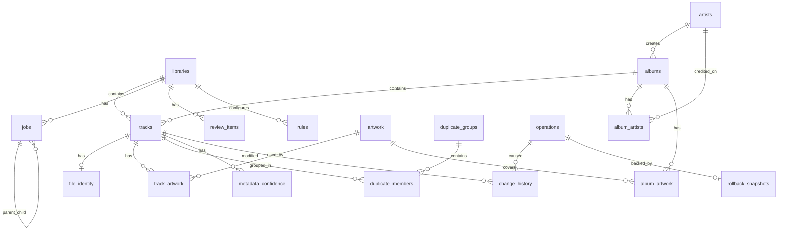

# 03 — Database Schema (v2)

> **Revision**: v2 — UUID identities, SQLAlchemy Core, job queue, review queue, staging zones.
> See [10-revision-v2.md](10-revision-v2.md) for design rationale.

## Design Principles

1. **SQLite with WAL mode** — concurrent reads during writes
2. **SQLAlchemy Core** — no ORM; explicit table definitions and batch SQL
3. **UUID v7 primary keys as BLOB(16)** — 16-byte binary storage, converted to `UUID` at application boundary
4. **Single-writer discipline** — only `DatabaseWriter` thread executes mutations; workers queue `WriteDTO`s
5. **Job queue in database** — persistent, resumable background processing
6. **Library zones** — incoming, staging, library, archive
7. **Confidence scores** — per-field + composite scoring for review routing
8. **Fingerprint persistence** — never recompute unless file identity changes
9. **Alembic migrations** — schema evolves with versioned upgrade scripts

> **v3 update**: UUID storage changed from TEXT(36) to BLOB(16). See [12-pipeline-engine-v3.md](12-pipeline-engine-v3.md).

## Entity-Relationship Diagram



---

## Core Library Tables

### `libraries`

| Column | Type | Constraints | Description |
|--------|------|-------------|-------------|
| `id` | BLOB(16) | PK | UUID v7 (binary) |
| `name` | TEXT | NOT NULL | Display name |
| `incoming_path` | TEXT | NOT NULL | Watch folder path |
| `staging_path` | TEXT | NOT NULL | Staging zone path |
| `library_path` | TEXT | NOT NULL | Canonical library path |
| `archive_path` | TEXT | NOT NULL | Archive zone path |
| `watch_enabled` | BOOLEAN | DEFAULT FALSE | Auto-process incoming |
| `auto_approve_threshold` | REAL | DEFAULT 0.90 | Min confidence for auto-approve |
| `created_at` | TEXT | NOT NULL | ISO 8601 |
| `updated_at` | TEXT | NOT NULL | ISO 8601 |

### `artists`

| Column | Type | Constraints | Description |
|--------|------|-------------|-------------|
| `id` | BLOB(16) | PK | UUID v7 (binary) |
| `name` | TEXT | NOT NULL | Canonical name |
| `sort_name` | TEXT | NOT NULL | Sort key |
| `mbid` | TEXT | NULL | MusicBrainz artist ID |
| `discogs_id` | TEXT | NULL | Discogs artist ID |
| `type` | TEXT | NULL | Person, Group, Orchestra |
| `country` | TEXT | NULL | ISO 3166-1 alpha-2 |
| `created_at` | TEXT | NOT NULL | |
| `updated_at` | TEXT | NOT NULL | |

**Indexes**: `idx_artists_name`, `idx_artists_sort_name`, `idx_artists_mbid`

### `albums`

| Column | Type | Constraints | Description |
|--------|------|-------------|-------------|
| `id` | BLOB(16) | PK | UUID v7 (binary) |
| `title` | TEXT | NOT NULL | |
| `sort_title` | TEXT | NOT NULL | |
| `album_artist_id` | BLOB(16) | FK → artists | |
| `year` | INTEGER | NULL | |
| `mbid` | TEXT | NULL | MusicBrainz release ID |
| `release_group_mbid` | TEXT | NULL | |
| `discogs_id` | TEXT | NULL | |
| `type` | TEXT | NULL | Album, Single, EP, Compilation |
| `genre` | TEXT | NULL | |
| `disc_count` | INTEGER | DEFAULT 1 | |
| `track_count` | INTEGER | DEFAULT 0 | Denormalized |
| `is_compilation` | BOOLEAN | DEFAULT FALSE | |
| `created_at` | TEXT | NOT NULL | |
| `updated_at` | TEXT | NOT NULL | |

**Indexes**: `idx_albums_title`, `idx_albums_mbid`, `idx_albums_artist`

### `tracks`

| Column | Type | Constraints | Description |
|--------|------|-------------|-------------|
| `id` | BLOB(16) | PK | UUID v7 (binary) |
| `library_id` | BLOB(16) | FK → libraries, NOT NULL | |
| `album_id` | BLOB(16) | FK → albums, NULL | |
| `artist_id` | BLOB(16) | FK → artists, NULL | |
| `zone` | TEXT | NOT NULL | `incoming`, `staging`, `library`, `archive` |
| `file_path` | TEXT | NOT NULL, UNIQUE | Absolute path |
| `file_name` | TEXT | NOT NULL | |
| `file_size` | INTEGER | NOT NULL | Bytes |
| `file_modified` | TEXT | NOT NULL | ISO mtime |
| `title` | TEXT | NULL | |
| `track_number` | INTEGER | NULL | |
| `disc_number` | INTEGER | DEFAULT 1 | |
| `duration_ms` | INTEGER | NULL | |
| `bitrate` | INTEGER | NULL | kbps |
| `bit_depth` | INTEGER | NULL | |
| `sample_rate` | INTEGER | NULL | Hz |
| `channels` | INTEGER | NULL | |
| `codec` | TEXT | NULL | |
| `is_lossless` | BOOLEAN | DEFAULT FALSE | |
| `quality_score` | INTEGER | NULL | 0–100 |
| `mb_recording_id` | TEXT | NULL | |
| `composer` | TEXT | NULL | |
| `genre` | TEXT | NULL | |
| `year` | INTEGER | NULL | |
| `has_embedded_art` | BOOLEAN | DEFAULT FALSE | |
| `is_corrupt` | BOOLEAN | DEFAULT FALSE | |
| `overall_confidence` | REAL | NULL | Min field confidence |
| `needs_review` | BOOLEAN | DEFAULT FALSE | |
| `created_at` | TEXT | NOT NULL | |
| `updated_at` | TEXT | NOT NULL | |

**Indexes**:
- `idx_tracks_library_zone` ON (`library_id`, `zone`)
- `idx_tracks_file_path` UNIQUE
- `idx_tracks_album`
- `idx_tracks_mb_recording`
- `idx_tracks_needs_review` WHERE `needs_review = TRUE`
- `idx_tracks_quality` ON (`quality_score`)

---

## File Identity (Fingerprint Persistence)

### `file_identity`

Stores computed hashes and fingerprints. Workers skip recomputation when all identity fields match.

| Column | Type | Constraints | Description |
|--------|------|-------------|-------------|
| `track_id` | BLOB(16) | PK, FK → tracks | |
| `content_hash_sha256` | TEXT | NOT NULL | Full file hash |
| `fingerprint_data` | BLOB | NULL | Chromaprint bytes |
| `fingerprint_duration` | REAL | NULL | Seconds |
| `fingerprint_hash` | TEXT | NULL | SHA256 of fingerprint bytes |
| `acoustid_id` | TEXT | NULL | |
| `acoustid_score` | REAL | NULL | |
| `file_size` | INTEGER | NOT NULL | Snapshot at computation time |
| `file_modified` | TEXT | NOT NULL | Snapshot at computation time |
| `hash_computed_at` | TEXT | NULL | |
| `fingerprint_computed_at` | TEXT | NULL | |

**Skip logic**: If `file_size` + `file_modified` on track match `file_identity` → skip hash and fingerprint workers entirely.

**Indexes**: `idx_file_identity_acoustid` ON (`acoustid_id`)

---

## Metadata Confidence

### `metadata_confidence`

Per-field confidence scores from metadata arbitration.

| Column | Type | Constraints | Description |
|--------|------|-------------|-------------|
| `id` | BLOB(16) | PK | UUID v7 (binary) |
| `track_id` | BLOB(16) | FK → tracks, NOT NULL | |
| `field_name` | TEXT | NOT NULL | `artist`, `album`, `title`, `year`, ... |
| `value` | TEXT | NULL | Resolved value |
| `confidence` | REAL | NOT NULL | 0.0–1.0 |
| `source` | TEXT | NOT NULL | `musicbrainz`, `discogs`, `local_tags`, `filename` |
| `updated_at` | TEXT | NOT NULL | |

**Indexes**: `idx_metadata_conf_track` ON (`track_id`)
**Unique**: (`track_id`, `field_name`)

---

## Job Queue

### `jobs`

Central job queue — the backbone of all background processing.

| Column | Type | Constraints | Description |
|--------|------|-------------|-------------|
| `id` | BLOB(16) | PK | UUID v7 (binary) |
| `library_id` | BLOB(16) | FK → libraries, NOT NULL | |
| `job_type` | TEXT | NOT NULL | See JobType enum |
| `status` | TEXT | NOT NULL | `pending`, `running`, `completed`, `failed`, `retry`, `cancelled` |
| `priority` | INTEGER | DEFAULT 100 | Lower = higher priority |
| `payload` | TEXT | NOT NULL | JSON job-specific data |
| `parent_job_id` | BLOB(16) | FK → jobs, NULL | Pipeline chaining |
| `attempt_count` | INTEGER | DEFAULT 0 | |
| `max_attempts` | INTEGER | DEFAULT 3 | |
| `error_message` | TEXT | NULL | |
| `created_at` | TEXT | NOT NULL | |
| `started_at` | TEXT | NULL | |
| `completed_at` | TEXT | NULL | |
| `scheduled_at` | TEXT | NULL | For delayed retry |

**Indexes**:
- `idx_jobs_claim` ON (`status`, `job_type`, `priority`, `created_at`) — worker claim query
- `idx_jobs_library` ON (`library_id`, `status`)
- `idx_jobs_parent` ON (`parent_job_id`)

### Job Types

| job_type | Enqueued By | Enqueues |
|----------|------------|----------|
| `scan_directory` | User / FileWatcher | `hash_file` |
| `hash_file` | Scanner | `fingerprint_file` (if changed) |
| `fingerprint_file` | HashWorker | `identify_metadata` |
| `identify_metadata` | FingerprintWorker | `fetch_artwork`, `detect_duplicates`, `evaluate_rules` |
| `fetch_artwork` | MetadataWorker | `organize_file` or review |
| `detect_duplicates` | MetadataWorker | (terminal or review) |
| `evaluate_rules` | MetadataWorker | `organize_file` or review |
| `organize_file` | Artwork/RuleWorker | `sync_media_server` |
| `sync_media_server` | OrganizerWorker | (terminal) |
| `generate_report` | User | (terminal) |

---

## Review Queue

### `review_items`

| Column | Type | Constraints | Description |
|--------|------|-------------|-------------|
| `id` | BLOB(16) | PK | UUID v7 (binary) |
| `library_id` | BLOB(16) | FK → libraries, NOT NULL | |
| `track_id` | BLOB(16) | FK → tracks, NULL | |
| `album_id` | BLOB(16) | FK → albums, NULL | |
| `duplicate_group_id` | BLOB(16) | FK → duplicate_groups, NULL | |
| `review_type` | TEXT | NOT NULL | See ReviewType enum |
| `status` | TEXT | NOT NULL | `pending`, `approved`, `rejected`, `deferred` |
| `title` | TEXT | NOT NULL | User-visible summary |
| `description` | TEXT | NULL | Detail / diff |
| `confidence` | REAL | NULL | Triggering confidence score |
| `payload` | TEXT | NULL | JSON context for GUI |
| `created_at` | TEXT | NOT NULL | |
| `resolved_at` | TEXT | NULL | |
| `resolved_by` | TEXT | NULL | `user`, `auto`, `rule` |

**Indexes**: `idx_review_library_status` ON (`library_id`, `status`)

### Review Types

| review_type | Trigger |
|-------------|---------|
| `unknown_artist` | Artist confidence < threshold |
| `unknown_album` | Album confidence < threshold |
| `metadata_conflict` | Providers disagree > 10% |
| `possible_duplicate` | Duplicate worker match |
| `artwork_missing` | No artwork found |
| `artwork_low_res` | Below min resolution |
| `low_quality` | Rule engine flag |
| `rule_action` | Rule requires approval |

---

## Rules Engine

### `rules`

| Column | Type | Constraints | Description |
|--------|------|-------------|-------------|
| `id` | BLOB(16) | PK | UUID v7 (binary) |
| `library_id` | BLOB(16) | FK → libraries, NOT NULL | |
| `name` | TEXT | NOT NULL | |
| `enabled` | BOOLEAN | DEFAULT TRUE | |
| `priority` | INTEGER | DEFAULT 100 | |
| `conditions` | TEXT | NOT NULL | JSON condition tree |
| `actions` | TEXT | NOT NULL | JSON action list |
| `requires_approval` | BOOLEAN | DEFAULT FALSE | |
| `created_at` | TEXT | NOT NULL | |
| `updated_at` | TEXT | NOT NULL | |

---

## Duplicates

### `duplicate_groups`

| Column | Type | Constraints | Description |
|--------|------|-------------|-------------|
| `id` | BLOB(16) | PK | UUID v7 (binary) |
| `library_id` | BLOB(16) | FK → libraries | |
| `match_type` | TEXT | NOT NULL | `fingerprint`, `mbid`, `hash`, `fuzzy` |
| `match_confidence` | REAL | NOT NULL | |
| `best_track_id` | BLOB(16) | FK → tracks | Highest quality_score |
| `track_count` | INTEGER | NOT NULL | |
| `detected_at` | TEXT | NOT NULL | |
| `status` | TEXT | DEFAULT `open` | `open`, `resolved`, `ignored` |
| `resolution` | TEXT | NULL | `kept_best`, `archived`, `manual` |

### `duplicate_members`

| Column | Type | Constraints |
|--------|------|-------------|
| `group_id` | BLOB(16) | PK, FK → duplicate_groups |
| `track_id` | BLOB(16) | PK, FK → tracks |
| `quality_score` | INTEGER | NOT NULL |
| `is_best` | BOOLEAN | DEFAULT FALSE |
| `zone` | TEXT | NOT NULL | Zone at detection time |

---

## Operations & Rollback

### `operations`

| Column | Type | Constraints | Description |
|--------|------|-------------|-------------|
| `id` | BLOB(16) | PK | UUID v7 (binary) |
| `operation_type` | TEXT | NOT NULL | |
| `status` | TEXT | NOT NULL | |
| `is_dry_run` | BOOLEAN | DEFAULT FALSE | |
| `description` | TEXT | NULL | |
| `affected_count` | INTEGER | DEFAULT 0 | |
| `started_at` | TEXT | NOT NULL | |
| `completed_at` | TEXT | NULL | |
| `snapshot_id` | BLOB(16) | FK → rollback_snapshots | |

### `change_history`

| Column | Type | Constraints | Description |
|--------|------|-------------|-------------|
| `id` | BLOB(16) | PK | UUID v7 (binary) |
| `operation_id` | BLOB(16) | FK → operations | |
| `track_id` | BLOB(16) | FK → tracks | |
| `change_type` | TEXT | NOT NULL | |
| `field_name` | TEXT | NULL | |
| `old_value` | TEXT | NULL | JSON |
| `new_value` | TEXT | NULL | JSON |
| `old_file_path` | TEXT | NULL | |
| `new_file_path` | TEXT | NULL | |
| `old_zone` | TEXT | NULL | |
| `new_zone` | TEXT | NULL | |
| `timestamp` | TEXT | NOT NULL | |

### `rollback_snapshots`

| Column | Type | Constraints | Description |
|--------|------|-------------|-------------|
| `id` | BLOB(16) | PK | UUID v7 (binary) |
| `operation_id` | BLOB(16) | FK → operations | |
| `snapshot_data` | BLOB | NOT NULL | Compressed JSON |
| `created_at` | TEXT | NOT NULL | |
| `restored_at` | TEXT | NULL | |

---

## Artwork, Plugins, Statistics

> **Documentation gap, found during Phase 2 (2026-07-15)**: this section originally
> said "unchanged from v1, see v1 schema for column details" — but the v1 schema
> document no longer exists (fully superseded by this v2 document), so the column
> details for `artwork`, `track_artwork`, `album_artwork`, and `plugin_state` were
> never actually carried forward. Rather than invent columns without a real spec,
> these tables are **deferred and will be designed properly when their owning phase
> starts**: `artwork`/`track_artwork`/`album_artwork` in Phase 11 (Artwork worker),
> `plugin_state` in Phase 6 (metadata providers) or Phase 15 (media server plugins).
> `library_stats` is deferred to Phase 13 (Reports) for the same reason.
> `media_server_state` is fully specified below and **is** created in Phase 2.

Structure (once designed) will follow v2 conventions: all PKs/FKs are UUID v7 stored
as **BLOB(16)** (see [12-pipeline-engine-v3.md](12-pipeline-engine-v3.md#uuid-storage-v7-as-blob16)).

Deferred tables (not yet created):
- `plugin_state` — Phase 6/15
- `library_stats` (materialized dashboard counters) — Phase 13

Created in Phase 2:
- `media_server_state` (connection config, last sync per server plugin)

Designed and created in Phase 11 (migration `0003`):
- `artwork`, `track_artwork`, `album_artwork` — see below

### `artwork` (Phase 11 re-design)

One row per **unique image**, deduplicated by content hash. Image bytes live on
disk under the app cache directory (`cache/artwork/<hash[:2]>/<hash>.<ext>`),
not as DB blobs, keeping the database small.

| Column | Type | Constraints | Description |
|--------|------|-------------|-------------|
| `id` | BLOB(16) | PK | UUID v7 (binary) |
| `content_hash_sha256` | TEXT | NOT NULL, UNIQUE | Dedup key |
| `source` | TEXT | NOT NULL | Provider id (`cover_art_archive`, `embedded_art`) |
| `source_id` | TEXT | NULL | e.g. the MusicBrainz release id fetched from |
| `mime_type` | TEXT | NOT NULL | |
| `width` | INTEGER | NOT NULL | Pixels |
| `height` | INTEGER | NOT NULL | Pixels |
| `file_size` | INTEGER | NOT NULL | Bytes |
| `file_path` | TEXT | NOT NULL | Cache-directory location of the bytes |
| `created_at` | TEXT | NOT NULL | |

### `track_artwork` / `album_artwork` (Phase 11 re-design)

Link tables. Composite PK on (`track_id`/`album_id`, `artwork_id`).

| Column | Type | Constraints | Description |
|--------|------|-------------|-------------|
| `track_id` / `album_id` | BLOB(16) | PK, FK | |
| `artwork_id` | BLOB(16) | PK, FK → artwork | |
| `role` | TEXT | NOT NULL, DEFAULT `'front'` | Only `front` used today |
| `is_primary` | BOOLEAN | NOT NULL, DEFAULT FALSE | |

### `media_server_state`

| Column | Type | Description |
|--------|------|-------------|
| `id` | BLOB(16) | UUID v7 |
| `library_id` | BLOB(16) | FK |
| `plugin_id` | TEXT | e.g. `navidrome` |
| `server_url` | TEXT | |
| `db_path` | TEXT | Optional direct DB path (Navidrome) |
| `config` | TEXT | JSON |
| `last_sync_at` | TEXT | |
| `last_sync_status` | TEXT | |

---

## SQLite Configuration

```python
PRAGMAS = [
    "PRAGMA journal_mode = WAL",
    "PRAGMA synchronous = NORMAL",
    "PRAGMA cache_size = -64000",       # 64 MB
    "PRAGMA mmap_size = 268435456",     # 256 MB
    "PRAGMA temp_store = MEMORY",
    "PRAGMA foreign_keys = ON",
    "PRAGMA busy_timeout = 5000",
]
```

## Migration Strategy

- **Tool**: Alembic (works with SQLAlchemy Core `MetaData`)
- **Location**: `src/musicvault/db/migrations/versions/`
- **First migration**: `001_initial_schema_v2.py`
- **Auto-run**: On startup; backup to `backups/auto/` before applying

## Storage Estimate (1M tracks)

| Table | Rows | Est. Size |
|-------|------|-----------|
| tracks | 1,000,000 | ~600 MB (UUID overhead) |
| file_identity | 1,000,000 | ~350 MB (includes fingerprint BLOBs) |
| metadata_confidence | ~8,000,000 | ~400 MB (~8 fields × 1M tracks) |
| jobs (rolling) | ~50,000 active | ~20 MB |
| review_items | ~10,000 | ~5 MB |
| **Total** | | **~1.4 GB** |

Acceptable for desktop. Fingerprint BLOBs are the largest contributor; optional offload to disk cache is a post-1.0 optimization.
