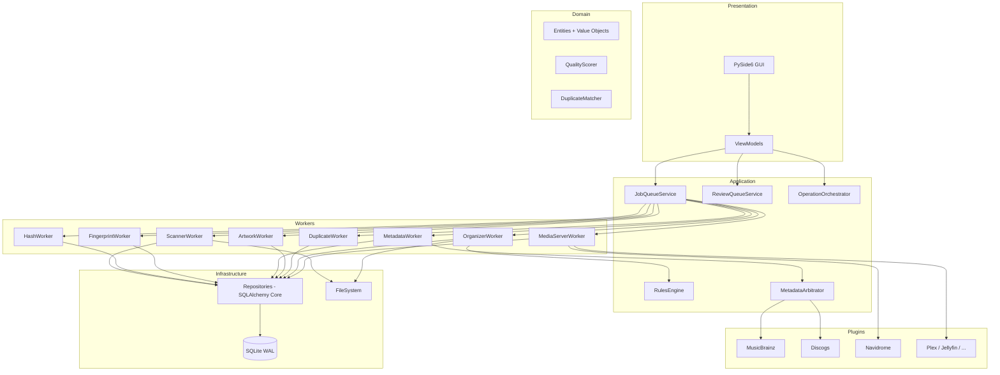
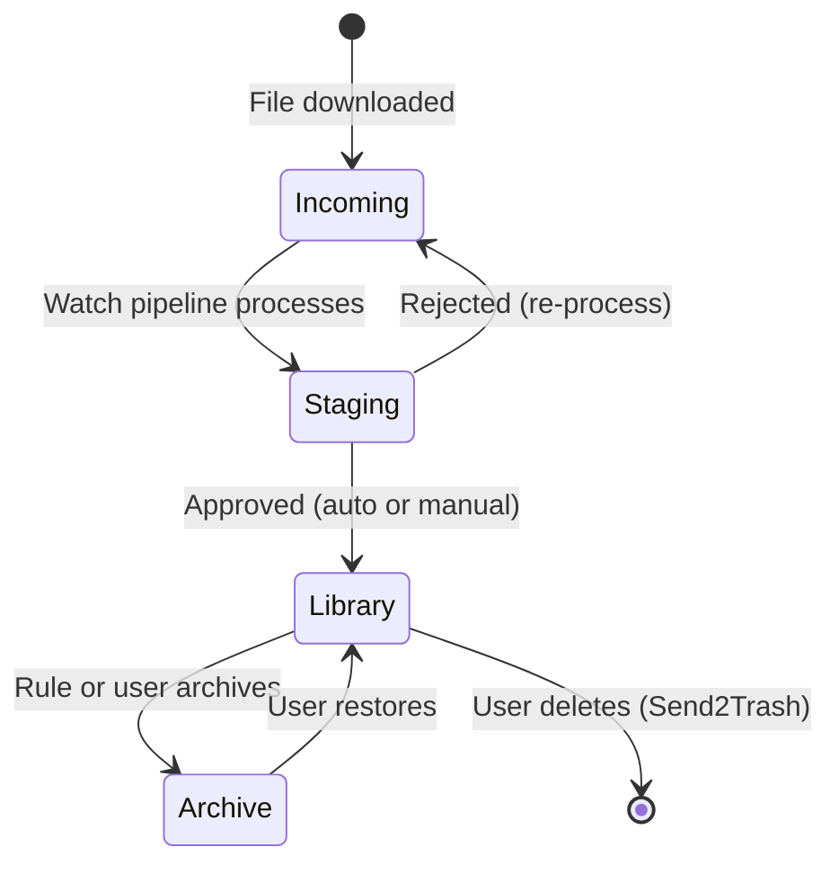

# 10 — Architecture Revision v2

> **Status**: Approved design direction. Supersedes v1 patterns where they conflict.
> **Date**: 2026-07-15
> **Prerequisite for**: Phase 1 scaffold

This document is the authoritative revision of the MusicVault architecture. It incorporates scalability review findings, the asynchronous job pipeline, UUID identities, confidence scoring, the rules engine, review queue, staging library, and expanded media server support.

---

## Executive Summary of Changes

| Area | v1 Design | v2 Design | Why |
|------|-----------|-----------|-----|
| Database access | SQLAlchemy ORM | **SQLAlchemy Core** | ORM identity map and lazy loading collapse at 1M+ rows |
| Primary keys | Auto-increment INTEGER | **UUID v7** (RFC 9562) | Import/export, plugin sync, rollback, no ID collision |
| Processing model | Monolithic scanner service | **Job queue + independent workers** | Resumable, parallel, decoupled pipeline stages |
| Metadata | MusicBrainz-first chain | **Multi-provider arbitration with confidence** | No single source of truth; ranked comparison |
| Uncertain results | Auto-apply or mark unknown | **Review queue with per-field confidence** | User approves anything below 90% |
| File placement | Direct organize | **Incoming → Staging → Review → Library** | Mistakes are reversible before touching the library |
| Automation | Manual scan triggers | **Watch folder + zero-click pipeline** | Killer feature for collectors |
| Business rules | Hard-coded organize logic | **User-configurable rules engine** | Picard lacks this entirely |
| Fingerprints | Generated during scan | **Stored permanently; skip if file unchanged** | Avoid recomputation on 1M tracks |
| Media servers | Subsonic API only | **API + direct DB access where available** | Navidrome SQLite exposes rich state instantly |
| CI | Planned for Phase 14 | **GitHub Actions from Phase 1** | No commit ships without lint, types, tests |

---

## Critical Scalability Review (v1 Risks)

### Risk 1: ORM Overhead at Scale — **CRITICAL**

**v1 problem**: SQLAlchemy ORM maintains an identity map, tracks object state, and issues row-by-row INSERTs unless carefully batched. At 1,000,000 tracks, this causes:

- Memory pressure from hydrated entity objects
- N+1 query patterns in relationship traversal
- Slower batch inserts (ORM flush overhead)
- Difficulty optimizing queries without fighting the ORM

**v2 mitigation**: SQLAlchemy Core with explicit SQL. Repositories use `connection.execute(insert(table), batch)` with 500-row chunks. No identity map. Domain entities are plain dataclasses mapped at the repository boundary.

**Expected gain**: 3–5× faster bulk inserts during scan; predictable memory usage.

---

### Risk 2: Synchronous Pipeline — **CRITICAL**

**v1 problem**: Even with fingerprinting "decoupled," the scan flow was still a sequential service call chain. A failure in metadata lookup blocks the pipeline. No resume after crash.

**v2 mitigation**: Persistent job queue. Each stage enqueues the next. Workers crash independently; jobs retry with exponential backoff. Application restart resumes pending jobs.

```
Scanner Worker
    → enqueues HashJob per new/changed file
Hash Worker
    → enqueues FingerprintJob (if hash changed or no fingerprint)
Fingerprint Worker
    → enqueues MetadataJob
Metadata Worker
    → enqueues ArtworkJob + DuplicateCheckJob + RuleEvaluationJob
Artwork Worker
    → enqueues ReviewJob (if confidence < threshold)
Organizer Worker
    → enqueues MediaServerSyncJob
```

Every arrow is a row in `jobs` table, not a function call.

---

### Risk 3: Integer IDs — **HIGH**

**v1 problem**: `ArtistID = 15` breaks on library merge, export/import, plugin sync, and rollback across databases.

**v2 mitigation**: UUID v7 everywhere. v7 is time-sortable (better B-tree index locality than v4) while remaining globally unique.

```python
# Domain entity
@dataclass(frozen=True)
class Track:
    id: UUID
    library_id: UUID
    album_id: UUID | None
    ...
```

SQLite stores UUIDs as `TEXT` (36 chars). Index size increase is acceptable (~36 bytes vs 8 bytes per key).

---

### Risk 4: Single Metadata Provider — **HIGH**

**v1 problem**: MusicBrainz-only identification fails on obscure releases, electronic music, bootlegs, and non-MB-catalogued content.

**v2 mitigation**: `MetadataArbitrator` queries all enabled providers in priority order, collects results with per-field confidence, and selects the highest-confidence value **per field** (not per provider).

Example: MusicBrainz gives Artist at 99% but Discogs gives Year at 97% while MusicBrainz Year is only 72% → take MB artist, Discogs year.

Provider priority (default):

1. MusicBrainz (fingerprint + tag + ID lookup)
2. Discogs
3. Cover Art Archive (artwork only)
4. Local embedded tags
5. Filename parser (lowest confidence, last resort)

---

### Risk 5: Auto-Apply Without Review — **HIGH**

**v1 problem**: Metadata fixes applied automatically. Wrong MB match on a ambiguous album corrupts the library.

**v2 mitigation**:
- Every metadata field carries a confidence score (0.0–1.0)
- Global threshold: **90%** (configurable)
- Any album/track with any field below threshold → `review_items` queue
- User approves, rejects, or edits in Review UI
- Only approved items move from Staging → Library

---

### Risk 6: No Staging Area — **MEDIUM**

**v1 problem**: Files organized directly into the library. A bad organize rule renames 50,000 files before the user notices.

**v2 mitigation**: Four library zones:

| Zone | Path (default) | Purpose |
|------|---------------|---------|
| `incoming` | `{root}/Incoming/` | Watch folder; new downloads land here |
| `staging` | `{root}/Staging/` | Processed but not yet approved |
| `library` | `{root}/Music/` | Approved, canonical library |
| `archive` | `{root}/Archive/` | Superseded copies (e.g., MP3 when FLAC exists) |

The organizer never writes directly to `library` without approval.

---

### Risk 7: Fingerprint Recomputation — **MEDIUM**

**v1 problem**: Incremental scan skips unchanged files for metadata but fingerprint strategy was ambiguous.

**v2 mitigation**: `file_identity` table stores `(path, size_bytes, modified_at, content_hash, fingerprint_hash)`. Worker compares all four. If identical → skip. Fingerprint computed once, stored forever unless file changes.

---

### Risk 8: GUI Thread Blocking — **MEDIUM**

**v1 problem**: Long operations in QThreadPool but no central visibility into job state.

**v2 mitigation**: Job queue is database-backed. GUI reads job status with a 1-second poll (or SQLite notification). Dashboard shows: Pending / Running / Failed / Completed counts per worker type. User can pause, retry, or cancel individual jobs.

---

### Risk 9: Navidrome API-Only Integration — **MEDIUM**

**v1 problem**: Subsonic API is slow for bulk validation (album-by-album). Cannot see scan status or internal duplicate detection.

**v2 mitigation**: Navidrome plugin reads `navidrome.db` directly (read-only SQLite connection) for:

- Album/artist/media_file tables
- Missing artwork flags
- Duplicate artist names
- Broken album paths
- Last scan timestamp

Falls back to Subsonic API when DB path unavailable or on non-Navidrome Subsonic servers.

---

### Risk 10: No CI Gate — **LOW (process risk)**

**v1 problem**: CI planned for Phase 14. Months of commits without automated checks.

**v2 mitigation**: GitHub Actions from Phase 1. Every push runs ruff, black, mypy --strict, pytest. Tagged releases build PyInstaller executable.

---

## Revised System Architecture



---

## Job Queue System (Core Infrastructure)

The job queue is the **central nervous system** of MusicVault. It replaces direct service-to-service calls for all background processing.

### Job Model

```python
@dataclass(frozen=True)
class Job:
    id: UUID
    library_id: UUID
    job_type: JobType
    status: JobStatus
    priority: int                    # Lower = higher priority
    payload: dict[str, Any]          # Job-specific data (track_id, path, etc.)
    parent_job_id: UUID | None       # Pipeline chaining
    attempt_count: int
    max_attempts: int                # Default 3
    error_message: str | None
    created_at: datetime
    started_at: datetime | None
    completed_at: datetime | None
    scheduled_at: datetime | None    # For delayed retry

class JobType(StrEnum):
    SCAN_DIRECTORY = "scan_directory"
    HASH_FILE = "hash_file"
    FINGERPRINT_FILE = "fingerprint_file"
    IDENTIFY_METADATA = "identify_metadata"
    FETCH_ARTWORK = "fetch_artwork"
    DETECT_DUPLICATES = "detect_duplicates"
    EVALUATE_RULES = "evaluate_rules"
    ORGANIZE_FILE = "organize_file"
    SYNC_MEDIA_SERVER = "sync_media_server"
    GENERATE_REPORT = "generate_report"

class JobStatus(StrEnum):
    PENDING = "pending"
    RUNNING = "running"
    COMPLETED = "completed"
    FAILED = "failed"
    RETRY = "retry"                  # Scheduled for retry after backoff
    CANCELLED = "cancelled"
```

### Job Dispatcher

```python
class JobDispatcher:
    """Polls jobs table, assigns to worker pools. Runs as background thread."""

    WORKER_POOLS: dict[JobType, ThreadPoolExecutor] = {
        JobType.SCAN_DIRECTORY:       ThreadPoolExecutor(max_workers=1),
        JobType.HASH_FILE:            ThreadPoolExecutor(max_workers=4),
        JobType.FINGERPRINT_FILE:     ThreadPoolExecutor(max_workers=2),
        JobType.IDENTIFY_METADATA:    ThreadPoolExecutor(max_workers=1),  # rate limited
        JobType.FETCH_ARTWORK:        ThreadPoolExecutor(max_workers=2),
        JobType.DETECT_DUPLICATES:    ThreadPoolExecutor(max_workers=1),
        JobType.EVALUATE_RULES:       ThreadPoolExecutor(max_workers=2),
        JobType.ORGANIZE_FILE:        ThreadPoolExecutor(max_workers=2),
        JobType.SYNC_MEDIA_SERVER:    ThreadPoolExecutor(max_workers=1),
    }

    def run_cycle(self) -> None:
        for job_type, pool in self.WORKER_POOLS.items():
            if self._has_capacity(pool):
                jobs = self._job_repo.claim_pending(job_type, limit=10)
                for job in jobs:
                    pool.submit(self._execute_job, job)
```

**Claim semantics**: `UPDATE jobs SET status='running', started_at=now WHERE id IN (SELECT id FROM jobs WHERE status='pending' AND job_type=? ORDER BY priority, created_at LIMIT ?)` — atomic, prevents double-processing.

### Pipeline Chaining

Workers enqueue downstream jobs on completion:

```python
class HashWorker:
    def execute(self, job: Job) -> None:
        track_id = UUID(job.payload["track_id"])
        identity = self._hash_service.compute(track_id)

        if identity.has_changed():
            self._job_repo.enqueue(JobType.FINGERPRINT_FILE, {"track_id": str(track_id)})
        else:
            # File unchanged — skip fingerprint, metadata, etc.
            self._job_repo.mark_completed(job.id)
```

### Resume After Crash

On startup, `JobDispatcher.recover()`:
1. Reset `status='running'` → `status='retry'` (orphaned jobs)
2. Process `status='retry'` with exponential backoff
3. Resume normal polling

---

## SQLAlchemy Core Data Access

### Why Core, Not ORM or SQLModel

| Approach | Verdict | Reason |
|----------|---------|--------|
| SQLAlchemy ORM | **Rejected** | Identity map, lazy loading, flush overhead at 1M rows |
| SQLModel | **Rejected** | Built on ORM; same scalability concerns |
| SQLAlchemy Core | **Selected** | Explicit SQL, batch inserts, connection pooling, Alembic compatible |
| Raw sqlite3 | **Rejected** | No migration tooling, no connection pool, manual SQL string management |

### Table Definitions

```python
# infrastructure/database/tables.py
from sqlalchemy import Table, Column, Text, Integer, Real, Boolean, MetaData

metadata = MetaData()

tracks = Table(
    "tracks",
    metadata,
    Column("id", Text, primary_key=True),           # UUID v7
    Column("library_id", Text, nullable=False),
    Column("album_id", Text),
    Column("artist_id", Text),
    Column("file_path", Text, nullable=False, unique=True),
    Column("zone", Text, nullable=False),             # incoming|staging|library|archive
    Column("file_size", Integer, nullable=False),
    Column("file_modified", Text, nullable=False),
    Column("title", Text),
    Column("duration_ms", Integer),
    Column("codec", Text),
    Column("quality_score", Integer),
    # ... remaining columns
)
```

### Repository Pattern

```python
class TrackRepository:
    def __init__(self, engine: Engine) -> None:
        self._engine = engine

    def upsert_batch(self, tracks: Sequence[Track]) -> int:
        rows = [self._to_row(t) for t in tracks]
        stmt = sqlite_insert(tracks).on_conflict_do_update(
            index_elements=["file_path"],
            set_={c.name: c for c in tracks.c if c.name != "id"},
        )
        with self._engine.begin() as conn:
            conn.execute(stmt, rows)
        return len(rows)

    def _to_row(self, track: Track) -> dict[str, Any]:
        """Map domain dataclass → dict for Core insert."""
        ...
```

Domain entities never import SQLAlchemy. Mapping happens only in repositories.

---

## UUID Strategy

### Choice: UUID v7 (RFC 9562)

| Version | Sortable | Unique | Index locality | Verdict |
|---------|----------|--------|----------------|---------|
| v4 (random) | No | Yes | Poor (random inserts) | Rejected |
| v7 (time-ordered) | Yes | Yes | Good (append-mostly) | **Selected** |
| ULID | Yes | Yes | Good | Alternative; less standard in Python |

Python 3.13+: use `uuid.uuid7()` (added in 3.12).

### Where UUIDs Are Used

**Everything**:
- `libraries.id`, `artists.id`, `albums.id`, `tracks.id`
- `jobs.id`, `operations.id`, `review_items.id`
- `duplicate_groups.id`, `rollback_snapshots.id`
- Foreign keys reference UUID strings

**Exception**: None. No auto-increment integers anywhere in the schema.

### External IDs Remain Separate

MusicBrainz IDs, AcoustID IDs, Discogs IDs are stored as their own columns (`mb_recording_id`, etc.). They are not used as primary keys.

---

## Metadata Arbitration

### Flow

```
MetadataWorker receives job
  → Load track fingerprint + existing tags
  → MetadataArbitrator.resolve(track)
      → Query each enabled MetadataProvider in priority order
      → Collect list[ProviderResult]
      → For each metadata field:
          → Select value with highest confidence
          → If best confidence < 0.90 → flag field for review
      → Return ArbitrationResult
  → Write winning values to track (in staging zone)
  → If any field flagged → enqueue ReviewJob
  → Else → enqueue ArtworkJob
```

### Provider Result

```python
@dataclass(frozen=True)
class FieldConfidence:
    field: str                       # "artist", "album", "year", ...
    value: str | int | None
    confidence: float                # 0.0–1.0
    source: str                      # "musicbrainz", "discogs", "local_tags", ...

@dataclass(frozen=True)
class ArbitrationResult:
    track_id: UUID
    fields: dict[str, FieldConfidence]
    overall_confidence: float        # Minimum field confidence
    needs_review: bool               # True if any field < threshold
    provider_results: list[ProviderResult]
```

### Per-Field, Not Per-Provider

MusicBrainz may win artist and album but lose on year to Discogs. The arbitrator picks the best value per field independently.

---

## Review Queue

### Review Item Types

| Type | Trigger |
|------|---------|
| `unknown_artist` | Artist confidence < 90% or no match |
| `unknown_album` | Album confidence < 90% |
| `metadata_conflict` | Providers disagree significantly (>10% confidence gap) |
| `possible_duplicate` | Duplicate worker flagged match |
| `artwork_missing` | No artwork after all providers exhausted |
| `artwork_low_res` | Artwork below minimum resolution |
| `low_quality` | Rule engine flagged bitrate < threshold |
| `rule_action` | Rule engine triggered action needing approval |

### Review Workflow

```
Item created in review_items (status=pending)
  → Appears in GUI Review page
  → User actions:
      Approve  → apply metadata, move staging → library
      Reject   → mark rejected, leave in staging
      Edit     → user corrects metadata manually, then approve
      Defer    → snooze for later
```

Nothing enters the `library` zone without explicit approval when review is required.

---

## Rules Engine

### Rule Model

```python
@dataclass
class Rule:
    id: UUID
    name: str
    enabled: bool
    priority: int
    conditions: RuleConditionGroup     # AND/OR tree
    actions: list[RuleAction]
    requires_approval: bool            # If True → review queue instead of auto-apply

@dataclass
class RuleCondition:
    field: str                           # "codec", "bitrate", "artist", "album", "zone", ...
    operator: str                      # "eq", "ne", "lt", "gt", "contains", "matches"
    value: str | int | float

@dataclass
class RuleAction:
    action_type: str                   # "move_to_zone", "archive", "flag_review", "set_genre", ...
    parameters: dict[str, Any]
```

### Example Rules (Shipped as Defaults)

```yaml
# Rule: Archive MP3 when FLAC exists
name: "Archive MP3 when FLAC exists"
conditions:
  all:
    - field: codec
      operator: eq
      value: mp3
    - field: has_lossless_duplicate
      operator: eq
      value: true
actions:
  - action_type: move_to_zone
    parameters:
      zone: archive

# Rule: Various Artists from filename
name: "Detect Various Artists"
conditions:
  all:
    - field: artist
      operator: eq
      value: ""
    - field: filename
      operator: contains
      value: "VA"
actions:
  - action_type: set_artist
    parameters:
      artist: "Various Artists"
  - action_type: flag_review
    parameters:
      reason: "Detected VA from filename"
```

### Evaluation

Rules evaluate after metadata identification and duplicate detection. `RuleEngine.evaluate(track)` returns matching actions. Actions with `requires_approval=True` create review items; others execute immediately (with rollback snapshot).

---

## Watch Folder / Incoming Pipeline

### Zero-Click Flow

```
New file appears in {root}/Incoming/
  → FileWatcher detects (ReadDirectoryChangesW on Windows)
  → Enqueue ScanFileJob
  → HashWorker → FingerprintWorker → MetadataWorker
  → DuplicateWorker (check against library)
  → ArtworkWorker
  → RuleEngine evaluation
  → OrganizerWorker (move to Staging, NOT Library)
  → If all confidence ≥ 90% AND no duplicates AND rules pass:
      Auto-approve → move Staging → Library
    Else:
      Create review items → wait for user
  → MediaServerWorker (trigger Navidrome rescan)
```

User configuration:
- `watch_folder_enabled: true/false`
- `auto_approve_threshold: 0.90`
- `auto_approve_requires_no_duplicates: true`

---

## Staging Library

### Zone State Machine



### Path Layout

```
D:/Music/
├── Incoming/          ← Watch folder (user drops files here)
├── Staging/           ← Processed, awaiting approval
│   ├── Artist/
│   │   └── 2024 - Album/
│   └── Various Artists/
├── Music/             ← Canonical library (FLAC/, MP3/, etc.)
│   ├── FLAC/
│   ├── MP3/
│   └── ...
└── Archive/           ← Superseded copies
    └── MP3/
```

---

## Fingerprint & Hash Persistence

### file_identity Table

| Column | Purpose |
|--------|---------|
| `track_id` | UUID FK |
| `content_hash_sha256` | Full file hash |
| `fingerprint_hash` | Hash of chromaprint bytes (detect fingerprint change) |
| `file_size` | Bytes |
| `file_modified` | ISO mtime |
| `fingerprint_data` | BLOB — chromaprint bytes |
| `fingerprint_duration` | Seconds |
| `acoustid_id` | Lookup result |
| `computed_at` | When fingerprint was generated |

### Skip Logic

```python
def needs_fingerprint(track: Track, identity: FileIdentity | None, file_stat: os.stat_result) -> bool:
    if identity is None:
        return True
    if identity.file_size != file_stat.st_size:
        return True
    if identity.file_modified != stat_mtime_iso(file_stat):
        return True
    return False  # Skip — fingerprint still valid
```

Same logic applies to content hash computation.

---

## Visual Duplicate Viewer (GUI)

### Duplicate Comparison Panel

Side-by-side card layout for each member of a duplicate group:

```
┌─────────────────────┐  ┌─────────────────────┐  ┌─────────────────────┐
│ [Album Art]         │  │ [Album Art]         │  │ [Album Art]         │
│ FLAC 24-bit         │  │ FLAC 16-bit         │  │ MP3 320             │
│ Score: 100          │  │ Score: 95           │  │ Score: 70           │
│ 12 tracks           │  │ 12 tracks           │  │ 12 tracks           │
│ 847 MB              │  │ 423 MB              │  │ 112 MB              │
│ 2024 Remaster       │  │ 2018 Release        │  │ 2024 Remaster       │
│                     │  │                     │  │                     │
│ [Keep] [Archive]    │  │ [Keep] [Archive]    │  │ [Keep] [Archive]    │
│        [Delete]     │  │        [Delete]     │  │        [Delete]     │
└─────────────────────┘  └─────────────────────┘  └─────────────────────┘
```

Metadata diff highlighted: fields that differ across copies shown in yellow.

Actions:
- **Keep** — mark as canonical, others become candidates for archive/delete
- **Archive** — move to Archive zone
- **Delete** — Send2Trash with confirmation

Duplicate groups with all copies in `library` zone flagged; groups with copies across zones shown with zone badges.

---

## Media Server Plugins (Expanded)

### Supported Servers

| Server | Protocol | Direct DB Access | API |
|--------|----------|-----------------|-----|
| **Navidrome** | Subsonic + SQLite | **Yes** (`navidrome.db`) | Subsonic API |
| **Jellyfin** | Jellyfin REST API | No | REST API |
| **Plex** | Plex API | No | Plex Media Server API |
| **Emby** | Emby REST API | No | REST API |
| **Ampache** | Ampache API | Optional (Ampache DB) | XML/JSON API |
| **Koel** | Koel API | Optional (MySQL/MariaDB) | REST API |
| **Subsonic** | Subsonic API | Depends on server | Subsonic API |
| **Funkwhale** | Funkwhale API | Optional (PostgreSQL) | REST API |
| **Lyrion Music Server** | SlimServer API | Optional | CLI/API |
| **mStream** | mStream API | No | REST API |

### Navidrome Direct DB Access

```python
class NavidromePlugin(MediaServerPlugin):
    def connect(self, config: NavidromeConfig) -> None:
        self._api = SubsonicClient(config.url, config.credentials)
        if config.db_path and Path(config.db_path).exists():
            self._db = sqlite3.connect(f"file:{config.db_path}?mode=ro", uri=True)
        else:
            self._db = None

    def get_albums_missing_artwork(self) -> list[ServerAlbum]:
        if self._db:
            return self._query_db(
                "SELECT id, name, artist_id FROM album WHERE id NOT IN "
                "(SELECT album_id FROM media_file WHERE has_cover_art = 1)"
            )
        return self._api.get_albums_without_artwork()  # slower fallback
```

**Security**: Read-only connection (`mode=ro`). DB path configured by user; never auto-detected without consent.

### Common MediaServerPlugin Interface

All servers implement the same protocol. Capabilities declared via feature flags:

```python
@dataclass(frozen=True)
class ServerCapabilities:
    direct_db_access: bool = False
    trigger_rescan: bool = True
    validate_metadata: bool = True
    detect_duplicates: bool = False
    get_missing_artwork: bool = True
```

---

## Revised Phase Plan

Phase 0 is extended with this revision. Phase 1 begins only after this document is committed.

| Phase | Deliverable |
|-------|-------------|
| **0b** | **Architecture revision v2 (this document)** |
| **1** | Scaffold: structure, DI, config, logging, tests, **GitHub Actions CI** |
| **2** | SQLAlchemy Core + Alembic + UUID schema + job queue tables |
| **3** | Domain models + repositories |
| **4** | Job dispatcher + scanner/hash workers |
| **5** | Fingerprint worker + persistence |
| **6** | Metadata arbitrator + providers |
| **7** | Review queue + confidence scoring |
| **8** | Rules engine |
| **9** | Duplicate worker + quality scoring |
| **10** | Organizer + staging zones + watch folder |
| **11** | Artwork worker |
| **12** | Rollback engine |
| **13** | Reports |
| **14** | GUI (all pages including Review + Duplicate Viewer) |
| **15** | Media server plugins |
| **16** | Packaging + installer |

---

## Design Decision Log

| # | Decision | Alternatives Considered | Justification |
|---|----------|----------------------|---------------|
| D1 | SQLAlchemy Core | ORM, SQLModel, raw sqlite3 | Core gives batch performance + Alembic without ORM overhead |
| D2 | UUID v7 | UUID v4, ULID, integer | Time-sortable, globally unique, import-safe |
| D3 | DB-backed job queue | Celery, Redis, in-memory | No external dependencies; survives restarts; single SQLite file |
| D4 | Per-field confidence | Per-provider confidence | Finer control; mix best fields from different providers |
| D5 | Staging zone | Direct-to-library | Prevents irreversible organize mistakes |
| D6 | Rules engine | Hard-coded logic | User customization; key differentiator vs Picard |
| D7 | Navidrome DB read | API-only | 100× faster bulk queries; optional fallback to API |
| D8 | File watcher | Manual scan only | Zero-click automation is the killer feature |
| D9 | Review queue | Auto-apply all | Prevents metadata corruption on ambiguous matches |
| D10 | CI from Phase 1 | CI at Phase 14 | Prevent broken commits from day one |

---

## What Phase 1 Will Deliver (Next Step)

When you approve this revision and switch to the implementation model, Phase 1 creates:

```
src/musicvault/
├── core/           config, container, logging, paths, exceptions
├── domain/         empty packages with __init__.py
├── application/    empty packages
├── infrastructure/ empty packages
├── plugins/        empty packages
└── gui/            empty packages

tests/conftest.py   fixtures, tmp dirs
pyproject.toml      dependencies, tool config
.github/workflows/ci.yml   ruff + black + mypy + pytest
config/defaults.json
```

Runnable: `python -m musicvault` prints version and exits 0.
CI: green on every push.

No database, no workers, no GUI — scaffold only.
